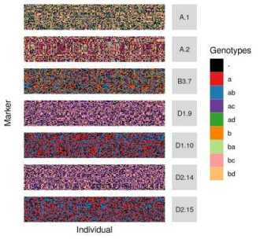
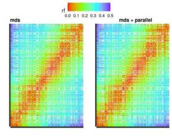

```{r knitr_init, echo=FALSE, cache=FALSE, message=FALSE}
library(knitr)
library(rmarkdown)
knitr::opts_chunk$set(collapse = TRUE,
                      comment = "#>",
                      fig.width = 6,
                      fig.height = 6,
                      fig.align = "center",
                      dev = "png",
                      dpi = 36,
                      cache = TRUE)
```

```{r, echo=FALSE, results='hide', message=FALSE, cache.comments=FALSE, warning=FALSE}
library(onemap)
```

The following example is intended to show the usage of `OneMap`
functions for linkage mapping in outcrossing (non-inbred) populations.
With basic knowledge of R syntax, one should have no problems using
it. If you are not familiar with R, we recommend reading the vignette
[Introduction to R](https://statgen-esalq.github.io/tutorials/onemap/Introduction_R.html).

Hopefully, these examples will be clear enough to help any user to
understand its functionality and start using it. You do not need to be
an expert in R to build your linkage map, but some concepts are
necessary and will help you through the process.

There is a GitHub `OneMap` version which is continuously improved, we strongly recommend all users to try [this version](https://github.com/augusto-garcia/onemap).  On `augusto-garcia/onemap` GitHub page you can find instructions to install the package from GitHub and also more fancy tutorials.

# Creating the data file

This step may be quite difficult because the data file is not very
simple, and some errors can occur while reading it. The input file format is similar to that used by MAPMAKER/EXP (Lander et al., 1987),
so experienced users of genetic analysis software should be already
familiar with this scenario.

The input file is a text file, where the first line indicates the cross-type, and the second line provides information about the number of individuals, the number of markers, the presence of physical marker locations, and the presence of phenotypic data. The third line contains the sample IDs. Then, the genotype information is included separately for each marker. The
character `*` indicates the beginning of information input for a new
marker, followed by the marker name. Next, there is a code indicating the marker type, according to Wu's et al. (2002a)
notation. It is recommended to check Wu's et al. (2002a)
paper before using `OneMap`.

Marker types must be one of the following: `A.1`, `A.2`, `A.3`, `A.4`,
`B1.5`, `B2.6`, `B3.7`, `C.8`, `D1.9`, `D1.10`, `D1.11`, `D1.12`,
`D1.13`, `D2.14`, `D2.15`, `D2.16`, `D2.17` or `D2.18`, each one
corresponding to a row of the following table:

|     |       |           | Parent         |                |    Offspring   |             |
|-----|-------|:---------:|:--------------:|:--------------:|:--------------:|:-----------:|
|     |       | Crosstype | Cross          | Observed bands | Observed bands | Segregation |
| $A$ |       |         1 | $ab \times cd$ | $ab \times cd$ | $ac, ad, bc, bd$ | $1:1:1:1$ |
|     |       |         2 | $ab \times ac$ | $ab \times ac$ | $a, ac, ba, bc$ | $1:1:1:1$|
|     |       |         3 | $ab \times co$ | $ab \times c$  | $ac, a, bc,b$  | $1:1:1:1$ |
|     |       |         4 | $ao \times bo$ | $a  \times  b$ | $ab, a, b, o$  | $1:1:1:1$ |
|     |       |           |                |                |       |  |
| $B$ | $B_1$ |         5 | $ab \times ao$ | $ab \times a$  | $ab, 2a,b$ | $1:2:1$ |
|     | $B_2$ |         6 | $ao \times ab$ | $a \times ab$  | $ab,2a,b$  | $1:2:1$ |
|     | $B_3$ |         7 | $ab \times ab$ | $ab \times ab$ | $a, 2ab,b$ | $1:2:1$ |
|     |       |           |                |                |       |  |
| $C$ |       |         8 | $ao \times ao$ | $a \times a$   | $3a, o$        |  $3:1$      |
|     |       |           |                |                |       |  |
| $D$ | $D_1$ |         9 | $ab \times cc$ | $ab \times c$  | $ac, bc$       |  $1:1$      |
|     |       |        10 | $ab \times aa$ | $ab \times a$  | $a, ab$        |  $1:1$      |
|     |       |        11 | $ab \times oo$ | $ab \times o$  | $a, b$         |  $1:1$      |
|     |       |        12 | $bo \times aa$ | $b \times a$   | $ab, a$        |  $1:1$      |
|     |       |        13 | $ao \times oo$ | $a \times o$   | $a, o$         |  $1:1$      |
|     | $D_2$ |        14 | $cc \times ab$ | $c \times ab$  | $ac, bc$       |  $1:1$      |
|     |       |        15 | $aa \times ab$ | $a \times ab$  | $a, ab$        |  $1:1$      |
|     |       |        16 | $oo \times ab$ | $o \times ab$  | $a, b$         |  $1:1$      |
|     |       |        17 | $aa \times bo$ | $a \times b$   | $ab, a$        |  $1:1$      |
|     |       |        18 | $oo \times ao$ | $o \times a$   | $a, o$         |  $1:1$      |

Letters `A`, `B`, `C` and `D` indicate the segregation type (_i.e._,
`1:1:1:1`, `1:2:1`, `3:1` or `1:1`, respectively), while the number
after the dot (_e.g._, `A.1`) indicates the observed bands in the
offspring. The paper cited above gives details with respect to marker types; we will not discuss them here, but it is easy to see that each
marker is classified based on the band patterns of parents and
progeny.

Finally, after each marker name, comes the genotype data for the
segregating population. The coding for marker genotypes used by
`OneMap` is also the same one proposed by Wu et al. (2002a), and the
possible values vary according to the specific marker type. Missing
data are indicated with the character `-` (minus sign), and an empty space separates the information for each individual. Phenotype information, if present, follows genotypic data with a similar structure. Details are found with the help of function `read_onemap`.

Here is an example of such a file for 10 individuals and 5 markers (the three zeros in the second line indicate that there is no chromosome information, physical position information, or phenotypic data, respectively). It
is very similar to a MAPMAKER/EXP file, but has additional information
about the cross-type.


```
data type outcross
10 5 0 0 0
I1 I2 I3 I4 I5 I6 I7 I8 I9 I10
*M1 B3.7 ab ab - ab b ab ab - ab b
*M2 D2.18 o - a a - o a - o o
*M3 D1.13 o a a o o - a o a o
*M4 A.4 ab b - ab a b ab b - a
*M5 D2.18 a a o - o o a o o o
```

Notice that once the marker type is identified, no variations of
symbols presented on the table for the **observed bands** are allowed.
For example, for `A.1`, only `ac`, `ad`, `bc`, and `bd` genotypes are
expected (plus missing values). **We notice in FAQs that this is a
common mistake made by users, so please be careful**.

The input file must be saved in text format, with extensions like
`.raw`. It is a good idea to open the text file called
`onemap_example_out.raw` (available with `OneMap` and saved in the directory
you installed it) to see how this file should be. You can see where
`OneMap` is installed using the command:

```{r, eval=FALSE}
system.file(package = "onemap")
``` 


In the session [`Importing data from VCF file`](#importing-data-from-vcf-file) below, you will see how to import VCF files as `OneMap` objects.

# Importing data

Once the input file is created, the data can be loaded and saved into an R
`onemap` object. The function used to import data is named `read_onemap`. Its usage is quite simple:


```{r, eval=FALSE}
onemap_example_out <- read_onemap(dir = "C:/workingdirectory", inputfile = "onemap_example_out.raw")
```

The first argument is the directory where the input file is located,
so modify it accordingly. The second one is the data file name. In
this example, an object named `onemap_example_out` was created. If you leave
the argument `dir` blank, the file will be loaded from your `working
directory`.

You can change the working directory in R using function `setwd()` or
in the toolbar clicking `File -> Change dir`. If you set your working
directory to the one containing the input file, you can just type:

```{r, eval=FALSE}
onemap_example_out <- read_onemap(inputfile = "onemap_example_out.raw")
``` 

If no error has occurred, a message will display some basic
information about the data, such as number of individuals and number
of markers:

```{r, echo=FALSE}
onemap_example_out <- read_onemap(inputfile = system.file("extdata/onemap_example_out.raw", package = "onemap"))
``` 

Because this particular dataset is distributed along with the package, as an alternative you can load it by typing:

```{r}
data("onemap_example_out")
``` 

Loading the data creates an object of class `onemap`, which will
further be used in the analysis. R command `print` recognizes
objects of this class. Thus, if you type:

```{r, eval=FALSE}
onemap_example_out
```

you will see some information about the object:

```{r, echo=FALSE}
onemap_example_out
```

Also, you can use the `plot.onemap` function to see graphically markers genotypes:

```{r}
plot(onemap_example_out)
```

Changing the argument `all` to `FALSE`, the markers will be separated by their type. In this case, you can note that the graphic cell size will adapt to the number of markers of the same type. In other words, the higher is the number of markers with the same type, the lower is the cell for this type.

```{r}
plot(onemap_example_out, all = FALSE)
```

This function can take quite some time, depending on the
number of markers involved. More information about this plot function can be found using `?plot.onemap`.

Also, you can see the number of markers by segregation pattern with the `plot_by_segreg_type` function:


## Importing data from VCF file

You can import information from `VCF` to `OneMap` using `onemap_read_vcfR` function.

With the `onemap_read_vcfR` you can convert the object from `vcfR` package directly to `onemap`. The `onemap_read_vcfR` function keeps chromosome and position information for each marker in the onemap object generated.

We will use the example file `vcf_example_out.vcf.gz` to show how it works, which contains markers from the same population of `onemap_example_out.raw`.

Here we use the the `vcfR` package internally to help this conversion. The `vcfR` authors mentioned in their [tutorials](https://knausb.github.io/vcfR_documentation/index.html) that RAM memory use is an important consideration when using the package. Depending of your dataset, the object created can be huge and occupy a lot of memory.

You can use `onemap_read_vcfR` function to convert the VCF file to  `onemap` object. The parameters used are the `vcf` with the VCF file path, the identification of each parent (here, you must define only one sample for each parent) and the cross type.

```{r, eval=FALSE}
vcf_example_out <- onemap_read_vcfR(vcf = system.file("extdata/vcf_example_out.vcf.gz", package = "onemap"),
                                    parent1 = "P1", 
                                    parent2 = "P2", 
                                    cross = "outcross")
```

```{r, echo=FALSE}
data(vcf_example_out)
```

Depending on your dataset, this function can take some time to run.

Note that the conversion filter out markers which are not informative for the informed cross type. For example, in outcrossing species, markers that have both parents homozygous (aa x bb) do not inform recombinations and are removed of the data set. Only markers types contained the table at [Creating the data file](#creating-the-data-file) are kept in the onemap object. Function `onemap_read_vcfR` print at the screen the reason why markers were filtered.

You can also have more missing data in the returned object compared with the VCF because the `onemap_read_vcfR` replace by missing data the genotypes that are not expected for that marker type. For example, for a marker type D1.10 (`ab` x `aa`), we only expect `aa` and `ab` genotypes, if there are `bb` genotypes they will be replaced by missing data. You can see the percentage of missing data at the resulted onemap object with:

```{r}
vcf_example_out
```

**NOTE**:From version 2.0.6 to 2.1.1005, `OneMap` had the `vcf2raw` function to convert `vcf` to `.raw`. Now, this function is defunct, but it can be replaced by a combination of `onemap_read_vcfR` and `write_onemap_raw` functions. See [Exporting .raw file from onemap object](#exporting-.raw-file-from-onemap-object) session to further information about `write_onemap_raw`.

# Filter onemap object by missing data

If your onemap object has too many missing genotypes you can face problems during the analysis. Check the percentage of missing genotypes in our data set printing the onemap object:

```{r}
vcf_example_out
```

Our example has 1% of missing genotypes (99% are genotyped). If you want to filter markers according to their percentage of missing data, you can use the function `filter_missing`:

```{r}
vcf_filtered <- filter_missing(vcf_example_out, threshold = 0.25)
```

Any of our markers were filtered, because, in this example, we do not have much missing data.

# Graphical view of genotypes and allele depths <span style="color:orange">(new!)</span>

Function `create_depth_profile` generates dispersion graphics with x and y-axis representing, respectively, the reference and alternative allele depths. The function is only available for biallelic markers in VCF files with allele counts information. Each dot represents a genotype for `mks` markers and `inds` individuals. If both arguments receive `NULL`, all markers and individuals are considered. Dots are colored according to the genotypes present in the onemap object (`GTfrom = onemap`) or VCF file (`GTfrom = vcf`). A rds file is generated with the data in the graphic (`rds.file`). The `alpha` argument controls the transparency of the color of each dot. Control this parameter is a good idea when having a large number of markers and individuals. The `x_lim` and `y_lim` control the axis scale limits; by default,  it uses the maximum value of the counts.

Here is an example for the `vcf_example_out` dataset.

```{r, message=F,warning=F, eval=FALSE}
# For outcrossing population
create_depths_profile(onemap.obj = vcf_example_out,
                      vcf = system.file("extdata/vcf_example_out.vcf.gz", package = "onemap"), 
                      parent1 = "P1", 
                      parent2 = "P2", 
                      vcf.par = "AD", 
                      recovering = FALSE, 
                      mks = NULL, 
                      inds = NULL, 
                      GTfrom = "vcf", 
                      alpha = 0.1,
                      rds.file = "depths_out.rds")
```

Because the genotypes are from VCF file, the legend points the VCF codification? `./.` represent missing data; `0/0` homozygotes for reference alleles; `0/1` heterozygotes; `1/1` homozygotes for alternative alleles. You can also have phased genotypes represented which have pipe `|` instead of bar `/`.

# Combining `OneMap` datasets

If you have more than one dataset of markers, all from the same mapping population, you can use the function `combine_onemap` to merge them into only one `onemap` object.

In our example, we have two datasets: 

* first: `onemap_example_out` with 30 markers and 100 individuals
* second: `vcf_example_out` with 24 biallelic markers and 92 individuals.

The `combine_function` recognizes the correspondent individuals by the ID, thus, it is important to define the same IDs to respective individuals in both `raw` files. Compared with the first file, the second file does not have markers information for 8 individuals. The `combine_onemap` will complete this information with NA.

In our examples, we have only genotypic information, but the function can also merge the phenotypic information if it exists.


```{r}
comb_example <- combine_onemap(onemap_example_out, vcf_example_out)
comb_example
```

The function arguments are the names of the `onemap` objects you want to combine.

Plotting markers genotypes from the outputted `onemap` object, we can see that there are more missing data `-` (black vertical lines) for some individuals because they were missing in the second file.


```{r}
plot(comb_example)
```

# Find redundant markers

It is possible that there are redundant markers in your dataset, especially when dealing with too many markers. Redundant markers have the same genotypic information that other markers because they didn't happen recombination events between each other. They will not increase information on the map but will increase computational effort during the map building. Therefore, it is a good practice to remove them to build the map and, once the map is already built, they can be added again.

First, we use the function `find_bins` to group the markers into bins according to their genotypic information. In other words, markers with the same genotypic information will be in the same bin.

```{r}
bins <- find_bins(comb_example, exact = FALSE)
bins
```

The first argument is the `onemap` object and the `exact` argument specifies if only markers with the same information will be at the same bin. Using `FALSE` at this second argument, missing data will not be considered, and the marker with the lowest amount of missing data will be the representative marker on the bin.

Our example dataset has only two redundant markers. We can create a new `onemap` object without them, using the `create_data_bins` function. This function keeps only the most representative marker of each bin from the `bins` object.

```{r}
bins_example <- create_data_bins(comb_example, bins)
bins_example
```

The arguments for the `create_data_bins` function are the `onemap` object and the object created by the `find_bins` function.


# Exporting .raw file from onemap object

The functions `onemap_read_vcfR` generates new onemap objects without use a input `.raw` file. Also, the functions `combine_onemap` and `create_data_bins` manipulate the information of the original `.raw` file and creates a new dataset. In both cases, you do not have an input file `.raw` that contains the same information as the analyzed data. If you want to create a new input file with the dataset you are working on after using these functions, you can use the function `write_onemap_raw`. 

```{r, eval=FALSE}
write_onemap_raw(bins_example, file.name = "new_dataset.raw")
```

The file `new_dataset.raw` will be generated in your working directory. In our example, it contains only non-redundant markers from `onemap_example_out` and `vcf_example_out` datasets.

# Testing segregation pattern

For the map building process, it is also important to know which markers have deviations in the expected segregation pattern. It can be a good practice to remove them from the map building process, because they can adversely affect the map building, and, once the map is built, they can be inserted.

The function `test_segregation_of_a_marker` performs a chi-square test according to Mendelian segregation to check if a specific marker is following the expected segregation pattern. 

```{r}
test_segregation_of_a_marker(bins_example, 4)
```

The arguments are the `onemap` object and the number of the marker you want to test.

You can also test all the markers in your `onemap` object using the `test_segregation` function. The results can be viewed by printing the output object of class `onemap_segreg_test`.

```{r}
segreg_test <- test_segregation(bins_example)
print(segreg_test)
```

The only argument of the function is a `onemap` object. 

Once we have the `onemap_segreg_test`object, the function `select_segreg` can be used to show only the markers considered with/without segregation distortion. By default, it uses as a threshold for the test a global $\alpha=0.05$, corrected for multiple tests with Bonferroni correction.

```{r}
select_segreg(segreg_test, distorted = TRUE) #to show the markers names with segregation distortion
select_segreg(segreg_test, distorted = FALSE) #to show the markers names without segregation distortion
```

It is not recommended, but you can define a different threshold value by changing the `threshold` argument of the function `select_segreg`. 

For the next steps, it will be useful to know the numbers of each marker with segregation distortion, so then you can keep those out of your map building analysis. These numbers refer to the lines where markers are located on the data file.

To access the corresponding number for these markers you can change the `numbers` argument:

```{r}
dist <- select_segreg(segreg_test, distorted = TRUE, numbers = TRUE) #to show the markers numbers with segregation distortion
dist
no_dist <- select_segreg(segreg_test, distorted = FALSE, numbers = TRUE) #to show the markers numbers without segregation distortion
no_dist
```

You can also see the results graphically by:

```{r}
plot(segreg_test)
```

# Strategies for this tutorial example

Now, we start the map building analysis. In this example, we follow two different strategies:

* Using only recombinations information.

* Using the recombinations and also the reference genome information, once our example has `CHROM` and `POS` information for some of the markers.

First, we will apply the strategy using only recombinations information. In the second part of this tutorial, we show a way to use also reference genome information. At the end of our analysis, we will be able to compare these two strategies by drawing the resulted genetic maps.

# Using only recombinations information

## Estimating two-point recombination fractions

The first step is estimating the recombination fraction between all pairs of markers, using two-point tests. 

```{r, twopoint, results='hide'}
twopts <- rf_2pts(bins_example)
``` 

Although two-point tests were implemented in C language, which is usually much
faster than R, this step can take quite some time, depending on the
number of markers involved and their segregation type, because all
combinations will be estimated and tested. Besides, the results use a
a lot of memory and a rather powerful computer is needed.

When the two-point analysis is finished, an object of class `rf_2pts`
is created. Typing

```{r, eval=FALSE}
twopts
```

will show a message with the criteria used in the analysis and some
other information:

```{r, echo=FALSE}
twopts
``` 

If you want to see the results for given markers, say `M1`
and `M3`, the command is:

```{r}
print(twopts, c("M1", "M3"))
``` 

Each line corresponds to a possible linkage phase. `CC` denotes the coupling
phase in both parents, `CR` and `RC` denote coupling phase in parent 1
and 2, respectively, and repulsion in the other, and `RR`
denotes the repulsion phase in both parents. Value `rf` is the maximum
likelihood estimate of the recombination fraction, with its corresponding
LOD Score.

## Assigning markers to linkage groups

Once the recombination fractions and linkage phases for all pairs of
markers have been estimated and tested, markers can be assigned to
linkage groups. To do this, first, use the function `make_seq` to
create a sequence with the markers you want to assign. 

The function `make_seq` is used to create sequences from objects of
several kinds, as will be seen along with this tutorial. 

Here, the object
is of class `rf_2pts` and the second argument specifies which markers
one wants to use. If one wants to use only a subset of
markers, say `M1` and `M2`, the option will be a vector with the corresponding numbers of the markers, as `c(1,2)`, you can also use a string `"all"` to specify that you want to analyze all markers. In our example, we will use the vector with the numbers of the markers with no segregation distortion.

```{r}
mark_no_dist <- make_seq(twopts, c(no_dist))
```

Because
the identification of the markers can be cumbersome, one should use
the function `marker type` to see their numbers, names, and types:

```{r} 
marker_type(mark_no_dist)
``` 

OneMap has two different functions for grouping markers. The `group` function:

```{r}
LGs <- group(mark_no_dist)
```

For this function, optional arguments are `LOD` and `max.rf`, which
define thresholds to be used when assigning markers to linkage groups.
If none is provided (default), it uses as default values of LOD Score `3` and maximum recombination fraction `0.50`.

Also, you can use the function `suggest_lod` to calculate a suggested LOD score considering that multiple tests are being performed.

```{r}
LOD_sug <- suggest_lod(mark_no_dist)
LOD_sug
```

And apply this suggested value to the two-point tests:

```{r}
LGs <- group(mark_no_dist, LOD=LOD_sug)
```

The previous command generates an object of class `group` and the
command `print` for such object has two options. If you type:

```{r, eval=FALSE}
LGs
``` 

you will get detailed information about the groups, that is, all linkage
groups will be printed, displaying the names of markers in each one of
them.

```{r, echo=FALSE}
LGs
``` 

However, in case you just want to see some basic information (such as
the number of groups, number of linked markers, etc), use:

```{r}
print(LGs, detailed = FALSE)
``` 

You can notice that all markers are linked to some linkage group. If
the LOD Score threshold is changed to a higher value, some markers are
kept unassigned:

```{r}
LGs <- group(mark_no_dist, LOD = 6)
LGs
``` 

Changing back to the previous criteria, now setting the maximum recombination fraction to 0.40:

```{r}
LGs <- group(mark_no_dist, LOD = LOD_sug, max.rf = 0.4)
LGs
``` 

<span style="color:orange">(new!)</span>

The other function for grouping is called `group_upgma`. It is an adapted version of [MAPpoly](https://github.com/mmollina/MAPpoly) grouping function. 

```{r}
LGs_upgma <- group_upgma(mark_no_dist, expected.groups = 5, inter = F)
plot(LGs_upgma)
```

You can define the expected number of groups in the `expected.groups` argument and check how the markers are split in the plotted dendrogram. Using argument `inter=TRUE` you can change interactively the number of groups defined by the red squares in the graphic. 

## Genetic mapping of linkage group 3

Once marker assignment to linkage groups is finished, the mapping step
can take place. First of all, you must set the mapping function that
should be used to display the genetic map throughout the analysis. You
can choose between `Kosambi` or `Haldane` mapping functions. To use
Haldane, type:

```{r, eval=FALSE}
set_map_fun(type = "haldane")
```

To use Kosambi, type:

```{r, eval=FALSE}
set_map_fun(type = "kosambi")
```

If you do not set one of these functions, the kosambi is used as default.

Now, you must define which linkage group will be mapped. In other
words, a linkage group must be `extracted` from the object of class
`group` or `group.upgma`, in order to be mapped. For simplicity, we will start here
with the smallest one, which is linkage group 3 (considering the `group` function). This can be easily
done using the following code:

```{r}
LG3 <- make_seq(LGs, 3)
# or
# LG3 <- make_seq(LGs_upgma,3)
```

The first argument (`LGs`) is an object of class `group` or `group.upgma` and the
second is a number indicating which linkage group will be extracted,
according to the results stored in object `LGs`. The object `LG3`,
generated by function `make_seq`, is of class `sequence`, showing that
this function can be used with several types of objects.

If you type

```{r, eval=FALSE}
LG3
``` 

you will see which markers are comprised in the sequence, and also
that no parameters have been estimated so far.

```{r, echo=FALSE}
LG3
``` 

To order these markers, one can use a two-point based algorithm such
as Seriation (Buetow and Chakravarti, 1987), Rapid Chain Delineation
(Doerge, 1996), Recombination Counting and Ordering (Van Os et al.,
2005) and Unidirectional Growth (Tan and Fu, 2006):

```{r,  results='hide'}
(LG3_ser <- seriation(LG3, hmm = FALSE))
(LG3_rcd <- rcd(LG3, hmm = FALSE))
(LG3_rec <- record(LG3, hmm = FALSE))
(LG3_ug <- ug(LG3, hmm = FALSE))
``` 

Argument `hmm` defines if the function should run the HMM chain multipoint approach to estimate the genetic distances given the marker order provided by the two-points ordering algorithm. We set here the argument `hmm=FALSE` because we just want to obtain the marker order. We are not yet estimating the genetic distances. We suggest to use `hmm=TRUE` only when you already decided which order is the best because the HMM chain is the most computationally intensive step in the map building. You can use `rf_graph_table` to check the ordering quality (see details below) and make editions in the marker order using `drop_marker`. After, you can use `map` or `map_avoid_unlinked` functions to estimate the genetic distances (check session #Map-estimation-for-an-arbitrary-order).

Here we can check, there are some differences between each ordering algorithm results (results not shown).

Alternatively, you can also use the `mds_onemap` function to obtain a first draft for the order of the markers. The `mds_onemap` is a wrapper function that makes an interface between `OneMap` and `MDSMap` package. The ordering approach presented in `MDSMap` provides a faster and efficient way of ordering markers using multi-dimensional scaling. The method also provides diagnostics graphics and parameters to find outliers to help users to filter the dataset. You can find more information in `MDSMap` [vignette](https://CRAN.R-project.org/package=MDSMap). Here we will show a simple example of how it can be used for ordering our example markers from an outcrossing population.

```{r}
LG3_mds <- mds_onemap(LG3, hmm = FALSE)
```

If you only specify the input sequence, mds_onemap will use the default parameters. It will also generate an MDSMap input file in the `out.file` file. You can use `out.file` in the MDSMap package to try other parameters too. The default method used is the principal curves, know more about using `?mds_onemap` and reading the MDSMap [vignette](https://CRAN.R-project.org/package=MDSMap). 

Besides these algorithms use a two-point approach to order the markers, if you set `hmm=TRUE` a multipoint approach is applied to estimate the genetic distances after the order is estimated. Thus,  it can happen that some markers are not considered linked when evaluated by multipoint information, and the function will return an error like this:

```
ERROR: The linkage between markers 1 and 2 did not reach the OneMap default criteria. They are probably segregating independently
```
You can automatically remove these markers setting argument `rm_unlinked = TRUE`. The marker will be removed, and the ordering algorithms will be restarted. Warning messages will inform which markers were removed. If you don't get warning messages, it means that any marker needed to be removed. This is our case in this example, but if you obtain an error or warning running your dataset, you already know what happened.

**NOTE**: <span style="color:orange">(new!)</span> If your sequence has many markers (more than 60), we suggest to first use hmm=FALSE to check the ordering and after speed up `mds`, `seriation`, `rcd`, `record` and `ug` using BatchMap parallelization approach. See section [`Speed up analysis with parallelization`](#speed-up-analysis-with-parallelization-new) for more information.

To order by comparing all possible orders (exhaustive search), the
function `compare` can be used:

```{r, eval=TRUE,  results='hide', eval=FALSE}
LG3_comp <- compare(LG3)
``` 

```{r, echo=FALSE}
data(LG3_comp)
```

**WARNING: This algorithm can take some time to run, depending on marker types in
the linkage group. If you are working on a personal computer, without high capacity, we recommend using a maximum of ten markers. **

If you have more markers in your group, we suggest using the following explained approaches
`order_seq`.

In the example, 
`LG3` contains only seven markers. Two of them are of type D1, and one is
segregating in 3:1 fashion (type C). Thus, although the number of possible orders is relatively small (360), for each order, there are various possible combinations of linkage phases. Also, the convergence of the EM algorithm takes considerably more time, because markers of type C and D are not very informative.

The first argument to the `compare` function is an object of class `sequence` (the extracted group `LG3`), and the object generated by this function is of class `compare`.

To see the results of the previous step, type:

```{r}
LG3_comp
``` 

Remember that for outcrossing populations, one needs to estimate
marker order and also linkage phases between markers for a given
order. However, because two-point analysis provides information
about linkage phases, this information is taken into consideration in
the `compare` function, reducing the number of combinations to be
evaluated. If a given linkage phase has LOD greater than 0.005 in the two-point analysis, we assume that this phase is very unlikely and so does not need to be evaluated in the multipoint procedure used by `compare`. We did extensive simulations, which showed that this is a good procedure.

By default, `OneMap` stores 50 orders, which may or may not be unique.
The value of `LOD` refers to the overall LOD Score, considering all
orders tested. `Nested LOD` refers to LOD Scores within a given order, that is, scores for different combinations of linkage phases for the same
marker order.

For example, order 1 has the largest value of log-likelihood and,
therefore, its LOD Score is zero for a given combination of linkage
phases (CC, CC, RR, RR). For this same order and other linkage phases, LOD Score is -5.20. Analyzing the results for order 2, notice that its highest LOD Score is very close to zero, indicating that this order is also quite plausible. Notice also that `Nested LOD` will always contain at least one zero value, corresponding to the best combination of phases for markers in a given order. Due to the information provided by a two-point analysis, not all combinations are tested, and that is the reason why the number of Nested LOD values is different for each order.

Unless one has some biological information, it is a good idea to
choose the order with the highest likelihood. The final map can then
be obtained with the command.

```{r}
LG3_final <- make_seq(LG3_comp, 1, 1)
``` 

The first argument is the object of class `compare`. The second argument indicates which order is chosen: 1 is for the order with the highest likelihood, 2 is for the second-best, and so on. The third argument indicates which combination of phases is chosen for a given order: 1 also means the combination with the highest likelihood among all combinations of phases (based on Nested LOD).

For simplicity, these values are defaults, so typing

```{r}
LG3_final <- make_seq(LG3_comp)
``` 

have the same effect.

To see the final map, type:

```{r}
LG3_final
``` 

At the leftmost position, marker names are displayed. `Position` shows
the cumulative distance using the Kosambi mapping function. Finally,
`Parent 1` and `Parent 2` show the diplotypes of both parents, that
is, the combination in which alleles are arranged in the chromosomes, given the estimated linkage phase. The notation is the same as that used by Wu et al. (2002a). Details about how ordering algorithms can be chosen and used are presented by Mollinari et al. (2009).

A careful examination of the results can be done using the function `rf_graph_table` to provide graphical view:

```{r}
rf_graph_table(LG3_final)
```

With the default arguments, this function plots the recombination fractions between the markers pointed in the axes. You can change the number of colors from the `rainbow` palette with the argument `n.colors`. Hot colors (more close to red) represent lower values of recombination fractions, as shown in the scale at the right side of the graphic. White cells indicate combinations of markers for which the recombination fractions cannot be estimated (D1 and D2). If you want to analyze the LOD values between the markers, use `graph.LOD = TRUE`.

```{r}
rf_graph_table(LG3_final, graph.LOD = TRUE)
```

If you change the `inter` argument to `TRUE`,  you should also specify an output HTML file name in `html.file`. This HTML contains an iterative plot graphic. If you hover the mouse cursor over the cells it shows some extra information about cells, as a percentage of missing data, marker name, and type. The output HTML file is generated in your work directory and opens automatically in your internet browser.

```{r, eval=FALSE}
rf_graph_table(LG3_final, inter = TRUE, mrk.axis= "names", html.file = "LG3.html")
```

For example, passing on the cell corresponding to markers `8` and `13`, you can see their names (`M8` and `M13` ), types (`B3.7` and `C.8`), recombination fraction (`rf = 0.03`) and LOD Scores for each possible linkage phase. This is quite useful in helping to interpret the results.

If you want to see corresponding marker numbers (not the names) in the axis, just change the argument `mrk.axis` to `numbers`. It can make the next steps easier.

```{r}
rf_graph_table(LG3_final, inter = FALSE, mrk.axis = "numbers")
```

The `rf_graph_table` can also be used to check the order of markers
based on the monotonicity of the matrix: as we get away from the
secondary diagonal, the recombination fraction values should increase.

It is possible to see a gap between markers `M7` and `M18` (numbers 7 and 18). In some cases, gaps could indicate that the group must be divided at this position, but here `SNP18` (number 43) also shows linkage with `M8`, which points that probably it is only a gap. Adding more markers to these groups could fill this gap.

Changing other arguments of the function, you can add/remove labels of the axes ('lab.xy') and add a title to the graph ('main').

```{r}
rf_graph_table(LG3_final, main = "LG3", inter = FALSE, n.colors = 7, lab.xy = c("markers", "markers"))
```

## Genetic mapping of linkage group 2

Now, let us map the markers in linkage group number 2.

Again, `extract` that group from the object `LGs`:

```{r}
LG2 <- make_seq(LGs, 2)
LG2
``` 

Note that there are more than 10 markers in this group, so it is infeasible to
use the `compare` function with all of them because it will take a very
long time to proceed.

First, use `rcd` to get a preliminary order estimate:

```{r}
LG2_rcd <- rcd(LG2, hmm = F)
LG2_rcd
rf_graph_table(LG2_rcd)
```

Use the `marker_type` function to check the segregation types of all
markers in this group:

```{r, , echo=TRUE}
marker_type(LG2)
``` 

Based on their segregation types and distribution on the preliminary
map, markers `M4`, `M20`, `M24`, `SNP22`, `SNP23`, `SNP24` and `SNP25` are the most
informative ones (type `A` is better, followed by type `B`). So,
let us create a framework of ordered markers using `compare` for the
most informative ones:

```{r, results='hide'}
LG2_init <- make_seq(twopts, c(4, 20, 24, 49,50,51, 52))
``` 

Here there is a automatic way of obtain a new sequence only with markers selected by type: <span style="color:orange">(new!)</span>

```{r}
LG2_init <- seq_by_type(sequence = LG2, mk_type = c("A", "B"))
marker_type(LG2_init)
# If I want to reduce even more the number of markers
# I can use drop_marker function
LG2_init <- drop_marker(LG2_init, 52)
marker_type(LG2_init)
```

Now, the first argument to `make_seq` is an object of class `rf_2pts`,
and the second argument is a vector of integers, specifying which
molecular markers comprise the sequence.

```{r, results='hide'}
LG2_comp <- compare(LG2_init)
```

Select the best order:

```{r}
LG2_frame <- make_seq(LG2_comp)
``` 

Also, we can obtain a useful diagnostic graphic using the function `rf_graph_table`.

```{r}
rf_graph_table(LG2_frame, mrk.axis = "numbers")
```

The graphic shows that there are two groups of markers, once `M20` and `M4` are far from the other markers. These markers could be in other linkage groups, or they are distant in the same group. Adding more markers will give more information to solve this issue.

Next, let us try to map the remaining markers, one at a time. First, we will try to add the remaining most informative markers. Starting with `SNP25`:

```{r, results='hide'}
LG2_extend <- try_seq(LG2_frame, 52)
```

```{r}
LG2_extend
``` 

Based on the LOD Scores, marker SNP25 is probably better located after `SNP22` (number 49). Detailed results can be seen with:

```{r}
print(LG2_extend, 7)
```

The second argument indicates the position where to place the marker.
Note that the first allele arrangement is the most likely one.

It should be pointed out that the framework created by the function
`compare` (with `M20`, `M4`, `SNP24`, `SNP23`, `M24` and `SNP22`, or numbers `20`, `4`, `51`,`50`, `24` and `49`) could be in
reverse order (`SNP22`, `M24`, `SNP23`, `SNP24`, `M4` and `M20`, or numbers `49`, `24`, `50`, `51`, `4`, `20`) and still represent the
same map. Thus, the positioning of markers with the `try_seq` command can be
different on your computer. For example, here marker `SNP25` (number `52`) was better
placed at position 7; however, if you obtain a reversed order, marker
`SNP25` would be better placed in position 1. In both cases, the best
position for this marker is after `SNP22`.

We can better evaluate the order with `rf_graph_table`. It requires an object of the `sequence` class with mapping information.

```{r, echo=TRUE}
LG2_test <- make_seq(LG2_extend, 7, 1)
``` 

When using `make_seq` with an object of class `try`, the second
argument is the position on the map (according to the scale on the
right of the output) and the last argument indicates linkage phases
(defaults to 1, higher nested LOD).

```{r}
rf_graph_table(LG2_test, mrk.axis = "numbers")
```

We can see that `SNP25` (or marker 52) was positioned at the end of the sequence and the color pattern shows that it is strongly linked with its neighbors, indicating that it is well-positioned. We will maintain this marker at this position:

```{r}
LG2_frame <- LG2_test
```

Adding other markers, one by one (output not shown):


```{r, results='hide'}
LG2_extend <- try_seq(LG2_frame, 9)
LG2_frame <- make_seq(LG2_extend, 3)
LG2_extend <- try_seq(LG2_frame, 16)
LG2_frame <- make_seq(LG2_extend, 1)
LG2_extend <- try_seq(LG2_frame, 21)
LG2_frame <- make_seq(LG2_extend, 4)
LG2_extend <- try_seq(LG2_frame, 23)
LG2_frame <- make_seq(LG2_extend, 5)
LG2_extend <- try_seq(LG2_frame, 27)
LG2_frame <- make_seq(LG2_extend, 1)
LG2_extend <- try_seq(LG2_frame, 29)
LG2_frame <- make_seq(LG2_extend, 12)
LG2_extend <- try_seq(LG2_frame, 45)
LG2_frame <- make_seq(LG2_extend, 8)
LG2_extend <- try_seq(LG2_frame, 46)
LG2_frame <- make_seq(LG2_extend, 7)
LG2_extend <- try_seq(LG2_frame, 47)
LG2_frame <- make_seq(LG2_extend, 7)
LG2_extend <- try_seq(LG2_frame, 48)
LG2_final <- make_seq(LG2_extend, 10)
``` 

Checking graphically:

```{r}
rf_graph_table(LG2_final)
```

The process of adding markers can be automated with the
use of function `order_seq`.

```{r}
LG2_ord <- order_seq(LG2, n.init = 5, THRES = 3)
``` 

This function automates what the `try_seq` function does,
using some predefined rules. In the function, `n.init = 5` means that
five markers (the most informative ones) will be used in the `compare`
step; `THRES = 3` indicates that the `try_seq` step will only add
markers to the sequence which can be mapped with LOD Score greater
than 3.

**NOTE**: Although very useful, this function can be misleading,
especially if there are not many fully informative markers, so use it
carefully. Results can vary between multiple runs on the same markers, of course.

Check the final order:

```{r}
LG2_ord
```

Note that markers `9`, `21`, `29`, `46`, `47`, `48`, `51` and `52` could not be safely mapped to a single
position (`LOD Score > THRES` in absolute value). The output displays
the `safe` order and the most likely positions for markers not mapped,
where `***` indicates the most likely position and `*` corresponds to
other plausible positions.

To get the safe order (_i.e._, without markers `9`, `21`, `29`, `46`, `47`, `48`, `51` and `52`), use

```{r}
LG2_safe <- make_seq(LG2_ord, "safe")
```

and to get the order with all markers, use

```{r}
LG2_all <- make_seq(LG2_ord, "force")
LG2_all
```

Notice that, for this linkage group, the `forced` map obtained with
`order_seq` is different from that obtained with `compare` plus
`try_seq`. It depends on which markers we choose to try to add first when doing
manually.

The `order_seq` function can also perform two rounds of the `try_seq`
algorithms, first using `THRES` and then `THRES - 1` as a threshold.
This generally results in safe orders with more markers mapped but
may take longer to run. To do this, use the `touchdown` option:

```{r, results='hide'}
LG2_ord <- order_seq(LG2, n.init = 5, THRES = 3, touchdown = TRUE)
```

```{r}
LG2_ord
```

For this particular sequence, the `touchdown` step could map safely markers `46` and `52`, but this depends on the specific dataset.

```{r}
rf_graph_table(LG2_all, mrk.axis = "numbers")
```

Finally, to check for alternative orders (because we did not use
exhaustive search), use the `ripple_seq` function:

```{r}
ripple_seq(LG2_all, ws = 4, LOD = LOD_sug)
``` 

We should do this to any of the orders we found, either using
`try_seq` or `order_seq`. Here, we choose `LG2_all` for didactic purposes only. The second argument, `ws = 4`, means that
subsets (windows) of four markers will be permuted sequentially
(`4!` orders for each window), to search for other plausible orders.
The `LOD` argument means that only orders with LOD Score smaller than
3.68 will be printed.

The output shows sequences of four numbers, because `ws = 4`. They are
followed by an `OK` if there is no alternative order with LOD
Score smaller than `LOD = LOD_sug` in absolute value, or by a list of
alternative orders. In the example, some sequences showed
alternative orders with LOD smaller than `LOD = LOD_sug`. However, the best order was the original one (`LOD = 0.00`).

If there were an alternative order more likely than the original, one
should check the difference between these orders (and linkage phases). 

In some cases, even if there are no better alternative orders suggested by `ripple_seq`, the graphic showed a color pattern different from the expected. Then, we can remove doubtful markers (for this groups markers `23` and `29`) and try to position them again. First, we use the function `drop_marker` to remove the selected marker of our sequence.

```{r}
LG2_test_seq <- drop_marker(LG2_all, c(23,29))
```

The function will provide a sequence with the same order as the estimated map (`LG2_all`). After, we should estimate the map again using this predefined order (see section [`Map estimation for an arbitrary order`](#map-estimation-for-an-arbitrary-order) for further information). For this we use the `map` function:

```{r, eval=FALSE}
(LG2_test_map <- map(LG2_test_seq))
```

**Warning**: If you find an error message like:

```
Error in as_mapper(.f, ...) : argument ".f" is missing, with no default
```

It's because the `map` function has a very common name, and you can have in your environment other functions with the same name. In the case of the pointed error, R is using the `map` function from `purrr` package instead of `OneMap`, to solve this, simply specify that you want the `OneMap` function with `::` command from `stringr` package:

```{r}
library(stringr)
(LG2_test_map <- onemap::map(LG2_test_seq))
```

**NOTE**: <span style="color:orange">(new!)</span> If your sequence has many markers (more than 60), we suggest to speed up `map` using BatchMap parallelization approach. See section [`Speed up analysis with parallelization`](#speed-up-analysis-with-parallelization-new) for more information.

Now, we have the map without markers `23` and `51`. 

```{r}
rf_graph_table(LG2_test_map, mrk.axis = "numbers")
```

We use the `try_seq` function to positioned them again:

```{r}
LG2_test_seq <- try_seq(LG2_test_map, 23)
LG2_test_23 <- make_seq(LG2_test_seq, 6)
LG2_test_seq <- try_seq(LG2_test_23, 29)
LG2_test_23_29 <- make_seq(LG2_test_seq, 12)
rf_graph_table(LG2_test_23_29, mrk.axis = "numbers")
```

Marker `23` kept its previous position, but marker `29` was re-positioned, configuring now a gap between markers `47` and `50`. We removed marker `29` from our map because its color pattern is too different from expected. Then, our final map is:

```{r}
LG2_final <- LG2_test_23
LG2_final
rf_graph_table(LG2_final, mrk.axis = "numbers")
```

## Genetic mapping of linkage group 1

Finally, linkage group 1 (the largest one) will be analyzed. Extract markers:

```{r}
LG1 <- make_seq(LGs, 1)
``` 

Construct the linkage map, by automatically using the try algorithm:

```{r, results='hide'}
LG1_ord <- order_seq(LG1, n.init = 6, touchdown = TRUE)
```

Notice that the second round of `try_seq` added markers `10`, `31`, `32`, `35`, `36`, and `40`.

```{r}
LG1_ord
```

Now, get the order with all markers:

```{r}
(LG1_frame <- make_seq(LG1_ord, "force"))
``` 

Check the map graphically:

```{r}
rf_graph_table(LG1_frame, mrk.axis = "numbers")
```

Check for alternative orders:

```{r}
ripple_seq(LG1_frame)
``` 

No better order was observed. 

Let's check how it behaves with the MDS approach:

```{r}
LG1_mds <- mds_onemap(LG1, rm_unlinked = TRUE, hmm = F)
```

```{r}
rf_graph_table(LG1_mds)
```

Based on the drafts from `order_seq` or/and `mds_onemap`, we can remove some doubtful markers accordingly with the graphic, try to position them again, and decide if and where we will maintain them.

```{r}
LG1_test_seq <- drop_marker(LG1_frame, c(10,11,28,42))
LG1_test_map <- onemap::map(LG1_test_seq)
```

```{r}
rf_graph_table(LG1_test_map, mrk.axis = "numbers")
```

```{r, results='hide'}
LG1_extend <- try_seq(LG1_test_map,10)
LG1_test_map <- make_seq(LG1_extend,15) 
LG1_extend <- try_seq(LG1_test_map,11)
LG1_test <- make_seq(LG1_extend,23) # We choose to remove this marker
LG1_extend <- try_seq(LG1_test_map,28)
LG1_test_map <- make_seq(LG1_extend,16) 
LG1_extend <- try_seq(LG1_test_map,42)
LG1_final <- make_seq(LG1_extend,17) 
```

Print it:
```{r}
LG1_final
```

```{r}
rf_graph_table(LG1_final)
```

As an option, different algorithms to order markers could be applied: 

```{r}
LG1_ser <- seriation(LG1, hmm = F)
rf_graph_table(LG1_ser)
LG1_rcd <- rcd(LG1, hmm = F)
rf_graph_table(LG1_rcd)
LG1_rec <- record(LG1, hmm = F)
rf_graph_table(LG1_rec)
LG1_ug  <- ug(LG1, hmm = F)
rf_graph_table(LG1_ug)
``` 

There are some differences between the results. Seriation did not
provide good results in this case. See Mollinari et al. (2009) for an
evaluation of these methods.

# Using the recombinations and the reference genome information

In our example, we have reference genome chromosome and position information for some of the markers; here, we will exemplify one method of using this information to help build the genetic map.

With the `CHROM` information in the input file, you can identify markers belonging to some chromosome using the function `make_seq` with the `rf_2pts` object. For example, assign the string `"1"` for the second argument to get chromosome 1 makers. The output sequence will be automatically ordered by `POS` information.

```{r}
CHR1 <- make_seq(twopts, "1")
CHR1
CHR2 <- make_seq(twopts, "2")
CHR3 <- make_seq(twopts, "3")
```

Here we use the string `"1"` because it is our chromosome ID, you can have a different string as ID, check this with:

```{r}
unique(bins_example$CHROM)
```

We can see that we have markers without chromosome information (`NA`) and markers with chromosome ID `"1"`, `"2"` and `"3"`. 

## Adding markers with no reference genome information

According to `CHROM` information we have three defined linkage groups, now we can try to group the markers without chromosome information to them using recombination information. For this, we can use the function `group_seq`:

```{r}
CHR_mks <- group_seq(input.2pts = twopts, seqs = "CHROM", unlink.mks = mark_no_dist,
                     repeated = FALSE)
```

The function works as the function `group` but considering pre-existing sequences. Setting `seqs` argument with the string `"CHROM"`, it will consider the pre-existing sequences according to `CHROM` information. You can also indicate other pre-existing sequences if they make sense for your study. For that, you should inform a list of objects of class `sequences`, as the example:

```{r, eval=FALSE}
CHR_mks <- group_seq(input.2pts = twopts, seqs = list(CHR1=CHR1, CHR2=CHR2, CHR3=CHR3), 
                     unlink.mks = mark_no_dist, repeated = FALSE)
```

In this case, the command had the same effect as the previous because we indicate chromosome sequences, but other sequences can be used.

The `unlink.mks` argument receives an object of class `sequence`; this defines which markers will be tested to group with the sequences in `seqs`. In our example, we will indicate only the markers with no segregation distortion, using the sequence `mark_no_dist`. It is also possible to use the string `"all"` to test all the remaining markers at the `rf_2pts` object. 

In some cases, the same marker can group into more than one sequence; those markers will be considered `repeated`. We can choose if we want to remove or not (`FALSE/TRUE`) them of the output sequences, with the argument `repeated`. Anyway, their numbers will be informed at the list `repeated` in the output object. 
In the example case, there are no repeated markers. However, if they exist, it could indicate that their groups actually constitute the same group. Also, genotyping errors can generate repeated markers. Anyway, they deserve better investigations. 

We can access detailed information about the results, just printing:

```{r}
CHR_mks
```

Also, we can access the numbers of repeated markers with:

```{r}
CHR_mks$repeated
```

We have no repeated markers.

In the same way, we can access the output sequences:

```{r}
CHR_mks$sequences$CHR1
# or
CHR_mks$sequences[[1]]
```

For this function, optional arguments are `LOD` and `max.rf`, which
define thresholds to be used when assigning markers to linkage groups.
If none is provided (default), criteria previously defined for the object
`rf_2pts` are used.

Now we can order the markers in each group as we made before in ([Genetic mapping of linkage group 1,2 and 3](#genetic-mapping-of-linkage-group-3)). As shown, we can choose different approaches to order the markers. 

To order those groups, first, we will use the `order_seq` function to access a preliminary order, and after, we will edit some marker's positions or remove some of them according to their color pattern in the `rf_graph_table` graphic, and other parameters as likelihood and map size. 

## Genetic mapping of linkage group 1 (with reference genome information)

```{r, results='hide'}
# CHR1_frame <- mds_onemap(CHR_mks$sequences$CHR1, hmm = F)
# or
CHR1_ord <- order_seq(CHR_mks$sequences$CHR1)
CHR1_frame <- make_seq(CHR1_ord, "force")
```

```{r, eval=FALSE}
rf_graph_table(CHR1_frame) # graphic not shown
```

The group is similar to that built before with only recombinations information. We will better explore differences in the later step. Only marker `11` does not follow the expected color pattern; then, we will try to reposition it.

```{r}
CHR1_test_seq <- drop_marker(CHR1_frame, 11)
CHR1_test_map <- onemap::map(CHR1_test_seq)
CHR1_add11_seq <- try_seq(CHR1_test_map, 11)
CHR1_add11 <- make_seq(CHR1_add11_seq, 25) # marker 11 was placed at the same position as before
```

Based in those results, we decide not to include marker 11 in our map.

```{r}
CHR1_test_map
```

```{r}
rf_graph_table(CHR1_test_map) 
```

```{r}
CHR1_final <- CHR1_test_map
```

Checking for better orders:

```{r}
ripple_seq(CHR1_final)
```

## Genetic mapping of linkage group 2 (with reference genome information)

```{r, results='hide'}
# CHR2_frame <- mds_onemap(CHR_mks$sequences$CHR2)
# or
CHR2_ord <- order_seq(CHR_mks$sequences$CHR2)
CHR2_frame <- make_seq(CHR2_ord, "force")
```

```{r, eval=FALSE}
rf_graph_table(CHR2_frame) # graphic not shown
```

As did before, we will not change the positions of the markers of this group.

```{r}
CHR2_final <- CHR2_frame
```

## Genetic mapping of linkage group 2 (with reference genome information)

```{r, results='hide'}
# CHR2_frame <- mds_onemap(CHR_mks$sequences$CHR2)
# or
CHR2_ord <- order_seq(CHR_mks$sequences$CHR2)
CHR2_frame <- make_seq(CHR2_ord, "force")
```

```{r, eval=FALSE}
rf_graph_table(CHR2_frame) # graphic not shown
```

As did before, we will not change the positions of the markers of this group.

```{r}
CHR2_final <- CHR2_frame
```

## Genetic mapping of linkage group 3 (with reference genome information)

```{r, results='hide'}
# CHR3_frame <- mds_onemap(CHR_mks$sequences$CHR3)
# or
CHR3_ord <- order_seq(CHR_mks$sequences$CHR3)
CHR3_frame <- make_seq(CHR3_ord, "force")
```

```{r, eval=FALSE}
rf_graph_table(CHR3_frame, mrk.axis = "numbers") # graphic not shown
```

Here, marker `29` has a color pattern too different from the expected, removing it could be influential in other markers ordering. Then we will remove them and search for a new order.

```{r, results='hide'}
CHR3_test_seq <- drop_marker(CHR3_frame, c(29))
CHR3_test_ord <- order_seq(CHR3_test_seq)
CHR3_test_map <- make_seq(CHR3_test_ord, "force")
```

```{r, eval=FALSE}
rf_graph_table(CHR3_test_map, mrk.axis = "numbers") #graphic not shown
```

Trying to add marker `29` again.

```{r, results='hide'}
CHR3_add29_seq <- try_seq(CHR3_test_map, 29)
CHR3_add29 <- make_seq(CHR3_add29_seq, 12) # Marker 29 increase the map size disproportionately, it was removed from the map
```

```{r}
CHR3_final <- CHR3_test_map
rf_graph_table(CHR3_final, inter = FALSE)
```

Checking for better orders:

```{r}
ripple_seq(CHR3_final)
```

# Drawing the genetic maps

Once all linkage groups were obtained using both strategies, we can draw a map for each approach using the function `draw_map`. Since version 2.1.1007, `OneMap` has a new version of `draw_map`, called `draw_map2`. The new function draws elegant linkage groups and presents new arguments to personalize your draw.

If you prefer the old function, we also keep it. Follow examples on how to use both of them.

## Draw_map

Drawing the map, which was built with only recombinations information.

```{r, echo=TRUE, fig=TRUE}
map1 <- list(LG1_final, LG2_final, LG3_final)
draw_map(map1, names = TRUE, grid = TRUE, cex.mrk = 0.7)
```

Drawing the map, which built with reference genome and  recombinations information

```{r, echo=TRUE, fig=TRUE}
map2 <- list(CHR1_final, CHR2_final, CHR3_final)
draw_map(map2, names = TRUE, grid = TRUE, cex.mrk = 0.7)
``` 

We also can draw maps comparing corresponding linkage groups in each strategy:

```{r, width = 9.5, height = 9.5}
CHR1_comp <- list(LG1_final, CHR1_final)
draw_map(CHR1_comp, names = TRUE, grid = TRUE, cex.mrk = 0.7)
```


```{r, width = 9.5, height = 9.5}
CHR2_comp <- list(LG3_final, CHR2_final)
draw_map(CHR2_comp, names = TRUE, grid = TRUE, cex.mrk = 0.7)
```

Both strategies produced the same result for CHR2 (the map is only inverted).

```{r, width = 9.5, height = 9.5}
CHR3_comp <- list(LG2_final, CHR3_final)
draw_map(CHR3_comp, names = TRUE, grid = TRUE, cex.mrk = 0.7)
``` 

Or groups alone:

```{r}
draw_map(CHR1_final, names = TRUE, grid = TRUE, cex.mrk = 0.7)
``` 

Function `draw_map` draws a straightforward graphic
representation of the genetic map. More recently, we developed a new version called `draw_map2` that brings a more sophisticated figure. Furthermore, once the distances and the
linkage phases are estimated, other map figures can be drawn by the
user with any appropriate software. There are several free software
that can be used, such as `MapChart` (Voorrips, 2002).

## Draw_map2

The same figures did with `draw_map` can be done with the `draw_map2` function. But it has different capacities and arguments. Here are some examples, but you can find more options on the help page `?write_map2`.

Drawing the map, which was built with only recombinations information:

```{r, echo=TRUE, results='hide', eval=FALSE}
draw_map2(LG1_final, LG2_final, LG3_final, main = "Only with linkage information", 
          group.names = c("LG1", "LG2", "LG3"))
```

```{r, echo=FALSE, results='hide'}
draw_map2(LG1_final, LG2_final, LG3_final, main = "Only with linkage information", 
          group.names = c("LG1", "LG2", "LG3"), output = "map1.png")
```


The figure will be saved in your work directory with the default name `map.eps`. You can change the file name and extension specifying them in the argument `output`.

Drawing the map, which was built with reference genome and  recombinations information

```{r, echo=TRUE, results='hide', eval=FALSE}
draw_map2(CHR1_final, CHR2_final, CHR3_final, output= "map_ref.pdf", 
          col.group = "#58A4B0",
          col.mark= "#335C81")
``` 

```{r, echo=TRUE, results='hide', echo=FALSE}
draw_map2(CHR1_final, CHR2_final, CHR3_final, output= "map_ref.png", 
          col.group = "#58A4B0",
          col.mark= "#335C81")
``` 


With the argument `tag`, we can highlight some markers with other colors. The arguments `col.group`, `col.mark` and `col.tag` can be changed to personalize the color of the groups, the markers, and the highlighted markers, respectively. 

We also can draw maps comparing corresponding linkage groups in each strategy:

```{r, results='hide', eval=FALSE}
draw_map2(LG1_final, CHR1_final, output = "map_comp.pdf", tag = c("M1","SNP2"))
```

```{r, results='hide', echo=FALSE}
draw_map2(LG1_final, CHR1_final, output = "map_comp.png", tag = c("M1","SNP2"))
```


When defining marker names in the `tag` argument, all markers with these names will be highlighted no matter in which group it/they is/are.

```{r, results='hide', eval=FALSE}
draw_map2(LG2_final, CHR3_final, tag= c("SNP17", "SNP18", "M29"), main = "Chromosome 3", 
          group.names = c("Only linkage", "With genome"), centered = TRUE, output = "map_comp2.pdf")
``` 

```{r, results='hide', echo=FALSE}
draw_map2(LG2_final, CHR3_final, tag= c("SNP17", "SNP18", "M29"), main = "Chromosome 3", 
          group.names = c("Only linkage", "With genome"), centered = TRUE, output = "map_comp2.png")
``` 


# Map estimation for an arbitrary order

If for any reason, one wants to estimate parameters for a given
linkage map (_e.g._, for other orders on published papers), it is
possible to define a sequence and use the `map` function. For example,
for markers `M30`, `M12`, `M3`, `M14` and `M2`, in this order, use:

```{r}
any_seq <- make_seq(twopts, c(30, 12, 3, 14, 2))
(any_seq_map <- map(any_seq))
``` 

**NOTE**: <span style="color:orange">(new!)</span> If your sequence has many markers (more than 60), we suggest to speed up `map` using BatchMap parallelization approach. See section [`Speed up analysis with parallelization`](#speed-up-analysis-with-parallelization-new) for more information.

**Warning**: If you find an error message like:

```
Error in as_mapper(.f, ...) : argument ".f" is missing, with no default
```

It's because the `map` function has a very common name, and you can have in your environment other functions with the same name. In the case of the pointed error, R is using `map` function from `purrr` package instead of `OneMap`, to solve this, simply specify that you want the `OneMap` function with `::` command from `stringr` package::

```{r, eval=FALSE}
library(stringr)
(any_seq_map <- onemap::map(any_seq))
```

This is a subset of the first linkage group. When used this way, the `map` function searches for the best combination of phases between markers
and prints the results.

<span style="color:orange">(new!)</span>

**Warning**: It is not our case in this example, but, sometimes, it can happen that some markers in your sequence don’t reach the `OneMap` linkage criteria when linkage are estimated by HMM multipoint approach using `map`, it will produce an error like this:

```
ERROR: The linkage between markers 1 and 2 did not reach the OneMap default criteria. They are probably segregating independently
```

You can evaluate the marker manually, or you can remove them automatically using the `map` argument `rm_unlinked = TRUE`. The `map` function will return a vector with marker numbers excluding the problematic marker; then, you can repeat the process without the marker, using `make_seq` to create a new sequence and repeat the `map`. You can also do it automatically using the `map_avoid_unlinked` function:  

```{r}
LG2_test_map <- map_avoid_unlinked(any_seq)
```

Using this, if `map` finds a problematic marker, it will print a warning pointing to the marker number, which was removed, and will automatically repeat the analysis without it.

Furthermore, a sequence can also have user-defined linkage phases. The
next example shows (incorrect) phases used for the same order of
markers:

```{r, eval=FALSE}
any_seq <- make_seq(twopts, c(30, 12, 3, 14, 2), phase = c(4, 1, 4, 3))
(any_seq_map <- map(any_seq))
``` 

If one needs to add or drop markers from a predefined sequence,
functions `add_marker` and `drop_marker` can be used. For example, to
add markers 4 to 8 to `any_seq`.

```{r}
(any_seq <- add_marker(any_seq, 4:8))
```

Removing markers 3, 4, 5, 12, and 30 from `any_seq`:

```{r}
(any_seq <- drop_marker(any_seq, c(3, 4, 5, 12, 30)))
```

After that, the map needs to be re-estimated.


# Speed up analysis with parallelization <span style="color:orange">(new!)</span>


**Warning**: Only available for outcrossing and f2 intercross populations.

As already mentioned, `OneMap` uses HMM multipoint approach to estimate genetic distances, a very robust method, but it can take time to run if you have many markers. In 2017, Schiffthaler et al. released an `OneMap` fork with modifications in CRAN and in GitHub with the possibility of parallelizing the HMM chain dividing markers in batches and use different cores for each phase. Their approach speeds up our HMM and keeps the genetic distance estimation quality. It allows us to divide the job into a maximum of four cores according to the four possible phases for outcrossing mapping populations. We add this parallelized approach to the functions: `map`, `mds_onemap`, `seriation`, `rcd`, `record` and `ug`. For better efficiency, batches must be composed of 50 markers or more; therefore, this approach is only recommended for linkage groups with many markers.

The parallelization is here available for all types of operational systems, however, we suggest setting argument `parallelization.type` to `FORK` if you are not using Windows system. It will improve the procedure speed.

Here we will show an example of how to use the BatchMap approach in some functions that requires HMM. For this, we simulated a group with 294 markers (we don't want this vignette to take too much time to run, but usually maps with markers from high-throughput technologies result in larger groups). Before start, you can see the time spent on each approach (see also [Session Info](#Session-Info)) in this example:

```{r, echo=FALSE, eval=FALSE}
# Need to run all code below with eval=FALSE and echo=FALSE
time_spent <-time_spent/(60*60)
colnames(time_spent) <- c("Without parallelization (h)", "With parallelization (h)" )
knitr::kable(time_spent)
```

|           | Without parallelization (h)| With parallelization (h)|
|:----------|---------------------------:|------------------------:|
|rcd        |                   0.6700558|                0.1612458|
|record_map |                   1.4368436|                0.2907308|
|ug_map     |                   0.7145778|                0.1884214|
|mds_onemap |                   1.0643083|                0.2827314|
|map        |                   2.0994486|                0.6107456|

Reading the simulated dataset:

```{r, eval=FALSE}
simParallel <- read_onemap(system.file(package = "onemap", "extdata/simParall_out.raw")) # dataset available only in onemap github version
plot(simParallel, all=FALSE)
```




```{r, eval=FALSE}
# Calculates two-points recombination fractions
twopts <- rf_2pts(simParallel)
seq_all <- make_seq(twopts, "all")
# There are no redundant markers
find_bins(simParallel)
# There are no distorted markers
p <- plot(test_segregation(simParallel))
```


To prepare the data with a defined bach size, we use the function `pick_batch_sizes`. It selects a batch size that splits the data into even groups. Argument `size` defines the batch size next to which an optimum size will be searched. `overlap` defines the number of markers that overlap between the present batch and next. This is used because pre-defined phases at these overlap markers in the present batch are used to start the HMM in the next batch. The `around` argument defines how much the function can vary around the defined number in `size` to search for the optimum batch size.

Some aspects should be considered to define these arguments because if the batch size were set too high, there would be less gain in execution time. If the overlap size were too small, phases would be incorrectly estimated, and large gaps would appear in the map, inflating its size. In practice, these values will depend on many factors such as population size, marker quality, and species. BatchMap authors recommended trying several configurations on a subset of data and select the best performing one.

```{r, eval=FALSE}
batch_size <- pick_batch_sizes(input.seq = seq_all, 
                               size = 80, 
                               overlap = 30, 
                               around = 10)
batch_size
```


## Speed up two-points ordering approaches

To use parallelized approach you just need to include the arguments when using the functions:

```{r, echo=FALSE, eval=FALSE}
time_spent <- data.frame("without-parallelization"= rep(0,5), "with-parallelization" =rep(0,5))
rownames(time_spent) <- c("rcd", "record_map", "ug_map", "mds_onemap", "map")
```

```{r, echo=FALSE, eval=FALSE}
# Without parallelization 
time <- system.time(rcd_map <- rcd(input.seq = seq_all))
time_spent$without.parallelization[1] <- time[3]
# With parallelization 
time <- system.time(rcd_map_par <- rcd(input.seq = seq_all,
                                       phase_cores = 4, 
                                       size = batch_size, 
                                       overlap = 30))
time_spent$with.parallelization[1] <- time[3]
```

```{r, echo=TRUE, eval=FALSE}
# Without parallelization 
rcd_map <- rcd(input.seq = seq_all)
# With parallelization 
rcd_map_par <- rcd(input.seq = seq_all,
                   phase_cores = 4, 
                   size = batch_size, 
                   overlap = 30)
```

```{r, echo=FALSE, eval=FALSE}
a <- rf_graph_table(rcd_map, mrk.axis = "none")
b <- rf_graph_table(rcd_map_par, mrk.axis = "none")
p <- ggarrange(a,b , common.legend = TRUE,
               labels = c("rcd", "rcd + parallel"), 
               vjust = 0.2,
               hjust= -1.4,
               font.label = list(size = 10),
               ncol=2, nrow=1)
ggsave(p, filename = "rcd.jpg")
```


```{r, echo=FALSE, eval=FALSE}
# Without parallelization 
time <- system.time(record_map <- record(input.seq = seq_all))
time_spent$without.parallelization[2] <- time[3]
# With parallelization 
time <- system.time(record_map_par <- record(input.seq = seq_all,
                                             phase_cores = 4, 
                                             size = batch_size, 
                                             overlap = 30))
time_spent$with.parallelization[2] <- time[3]
```

```{r, echo=TRUE, eval=FALSE}
# Without parallelization 
record_map <- record(input.seq = seq_all)
# With parallelization 
record_map_par <- record(input.seq = seq_all,
                         phase_cores = 4, 
                         size = batch_size, 
                         overlap = 30)
```

```{r, echo=FALSE, eval=FALSE}
a <- rf_graph_table(record_map, mrk.axis = "none")
b <- rf_graph_table(record_map_par, mrk.axis = "none")
p <- ggarrange(a,b , common.legend = TRUE,
               labels = c("record", "record + parallel"), 
               vjust = 0.2,
               hjust= -0.8,
               font.label = list(size = 10),
               ncol=2, nrow=1)
ggsave(p, filename = "record.jpg")
```


```{r, echo=FALSE, eval=FALSE}
# Without parallelization 
time <- system.time(ug_map <- ug(input.seq = seq_all))
time_spent$without.parallelization[3] <- time[3]
# With parallelization
time <- system.time(ug_map_par <- ug(input.seq = seq_all,
                                     phase_cores = 4, 
                                     size = batch_size, 
                                     overlap = 30))
time_spent$with.parallelization[3] <- time[3]
```

```{r, echo=TRUE, eval=FALSE}
# Without parallelization 
ug_map <- ug(input.seq = seq_all)
# With parallelization
ug_map_par <- ug(input.seq = seq_all,
                 phase_cores = 4, 
                 size = batch_size, 
                 overlap = 30)
```

```{r, echo=FALSE, eval=FALSE}
a <- rf_graph_table(ug_map, mrk.axis = "none")
b <- rf_graph_table(ug_map_par, mrk.axis = "none")
p <- ggarrange(a,b , common.legend = TRUE,
               labels = c("ug", "ug + parallel"), 
               vjust = 0.2,
               hjust= -1.6,
               font.label = list(size = 10),
               ncol=2, nrow=1)
ggsave(p, filename = "ug.jpg")
```


## Speed up mds_onemap

```{r, echo=FALSE, eval=FALSE}
# Without parallelization ok
time <- system.time(map_mds <- mds_onemap(input.seq = seq_all))
time_spent$without.parallelization[4] <- time[3]
# With parallelization
time <- system.time(map_mds_par <- mds_onemap(input.seq = seq_all, 
                                              phase_cores = 4, 
                                              size = batch_size, 
                                              overlap = 30))
time_spent$with.parallelization[4] <- time[3]
```

```{r, echo=TRUE, eval=FALSE}
# Without parallelization ok
map_mds <- mds_onemap(input.seq = seq_all)
# With parallelization
map_mds_par <- mds_onemap(input.seq = seq_all, 
                          phase_cores = 4, 
                          size = batch_size, 
                          overlap = 30)
```

```{r, echo=FALSE, eval=FALSE}
a <- rf_graph_table(map_mds, mrk.axis = "none")
b <- rf_graph_table(map_mds_par, mrk.axis = "none")
p <- ggarrange(a,b , common.legend = TRUE,
               labels = c("mds", "mds + parallel"), 
               vjust = 0.2,
               hjust= -1,
               font.label = list(size = 10),
               ncol=2, nrow=1)
ggsave(p, filename = "mds.jpg")
```



## Speed up map estimation for an arbitrary order (map function)

Because we simulate this dataset, we know the correct order. We can use  `map_overlapping_batches` to estimate genetic distance in this case. This is equivalent to `map`, but with a parallelized process.

```{r, echo=FALSE, eval=FALSE}
batch_map <- map_overlapping_batches(input.seq = seq_all,
                                     size = batch_size,
                                     phase_cores = 4,
                                     overlap = 30, 
                                     rm_unlinked = TRUE)
```

Similarly, with `map`, using argument `rm_unlinked = TRUE` the function will return a vector with marker numbers without the problematic marker. To repeat the analysis removing automatically all problematic markers use `map_avoid_unlinked`:

```{r, echo=FALSE, eval=FALSE}
# Without parallelization
time <- system.time(batch_map <- map_avoid_unlinked(input.seq = seq_all))
time_spent$without.parallelization[5] <- time[3]
# With parallelization
time <- system.time(batch_map_par <- map_avoid_unlinked(input.seq = seq_all,
                                                        size = batch_size,
                                                        phase_cores = 4,
                                                        overlap = 30))
time_spent$with.parallelization[5] <- time[3]
```

```{r, echo=TRUE, eval=FALSE}
# Without parallelization
batch_map <- map_avoid_unlinked(input.seq = seq_all)
# With parallelization
batch_map_par <- map_avoid_unlinked(input.seq = seq_all,
                                    size = batch_size,
                                    phase_cores = 4,
                                    overlap = 30)
```

```{r, echo=FALSE, eval=FALSE}
a <- rf_graph_table(batch_map, mrk.axis = "none")
b <- rf_graph_table(batch_map_par, mrk.axis = "none")
p <- ggarrange(a,b , common.legend = TRUE,
               labels = c("map", "map + parallel"), 
               vjust = 0.2,
               hjust= -1,
               font.label = list(size = 10),
               ncol=2, nrow=1)
ggsave(p, filename = "map.jpg")
```


As you can see in the above maps, heuristic ordering algorithms do not return an optimal order result, mostly if you don't have many individuals in your population. Because of the erroneous order, generated map size is not close to the simulated size (100 cM) and their heatmaps don't present the expected color pattern. Two of them get close to the color pattern, they are the ug and the MDS method. They present the right global ordering but not local. If you have a reference genome, you can use its position information to rearrange the local order.

# Export estimated parents haplotypes <span style="color:orange">(new!)</span>

In the older version, users could only access the estimated linkage phase by observing the print in the console:

```{r}
CHR3_final
```

Now, you can export this information into a data.frame using:

```{r}
(parents_haplot <- parents_haplotypes(CHR3_final))
```

```{r, eval=FALSE}
write.table(parents_haplot, "parents_haplot.txt")
```

The data.frame contains: group ID (group), marker number (mk.number) and names (mk.names), position in centimorgan (dist) and parents haplotypes (P1_1, P1_2, P2_1, P2_2).

You can also obtain a data.frame with a list of sequences and personalize the group names:

```{r}
parents_haplotypes(CHR2_final,CHR3_final, group_names=c("CHR2","CHR3"))
```


# Export estimated progeny haplotypes <span style="color:orange">(new!)</span>

Function `progeny_haplotypes` generates a data.frame with progeny phased haplotypes estimated by `OneMap` HMM. For progeny, the HMM results in probabilities for each possible genotype, then the generated data.frame contains all possible genotypes. If `most_likely = TRUE`, the most likely genotype receives 1 and the rest 0 (if there are two most likely both receive 0.5), if `most_likely = FALSE` genotypes probabilities will be according to the HMM results. You can choose which individual to be evaluated in `ind`. The data.frame is composed by the information: individual (ind) and group (grp) ID, position in centimorgan (pos), progeny homologs (homologs), and from each parent the allele came (parents).


```{r}
(progeny_haplot <- progeny_haplotypes(CHR2_final, most_likely = TRUE, ind = c(1,2), group_names = "CHR2_final"))
```

You can also have a view of progeny estimated haplotypes using `plot`. It shows which markers came from each parent’s homologs. `position` argument defines if haplotypes will be plotted by homologs (`stack`) or alleles (`split`). `split` option is a good way to view the likelihoods of each allele.

```{r}
plot(progeny_haplot, position = "stack")
plot(progeny_haplot, position = "split")
```


# Session Info

```{r}
sessionInfo()
```


# References

Buetow, K. H., Chakravarti, A. Multipoint gene mapping using
seriation. I. General methods. **_American Journal of Human
Genetics_** 41, 180-188, 1987.

Doerge, R.W. Constructing genetic maps by rapid chain delineation.
**_Journal of Agricultural Genomics_** 2, 1996.

Mollinari, M., Margarido, G. R. A., Vencovsky, R. and Garcia, A. A. F.
Evaluation of algorithms used to order markers on genetics maps.
**_Heredity_** 103, 494-502, 2009.

Schiffthaler, B., Bernhardsson, C., Ingvarsson, P. K., & Street, N. R. 
BatchMap: A parallel implementation of the OneMap R package for fast 
computation of F1 linkage maps in outcrossing species. **_PLoS ONE_**, 
12(12), 1–12, 2017.

Tan, Y., Fu, Y. A novel method for estimating linkage maps.
**_Genetics_** 173, 2383-2390, 2006.

Van Os H, Stam P, Visser R.G.F., Van Eck H.J. RECORD: a novel method
for ordering loci on a genetic linkage map. **_Theor Appl Genet_**
112, 30-40, 2005.

Voorrips, R.E. MapChart: software for the graphical presentation of
linkage maps and QTLs. **_Journal of Heredity_** 93, 77-78, 2002.

Voorrips, R. E., Maliepaard, C. A. The simulation of meiosis 
in diploid and tetraploid organisms using various genetic models. 
**_BMC Bioinformatics_**, 13(1), 248, 2012.

Wu, R., Ma, C.X., Painter, I. and Zeng, Z.-B. Simultaneous maximum
likelihood estimation of linkage and linkage phases in outcrossing
species. **_Theoretical Population Biology_** 61, 349-363, 2002a.

Wu, R., Ma, C.-X., Wu, S. S. and Zeng, Z.-B. Linkage mapping of
sex-specific differences. **_Genetical Research_** 79, 85-96, 2002b.