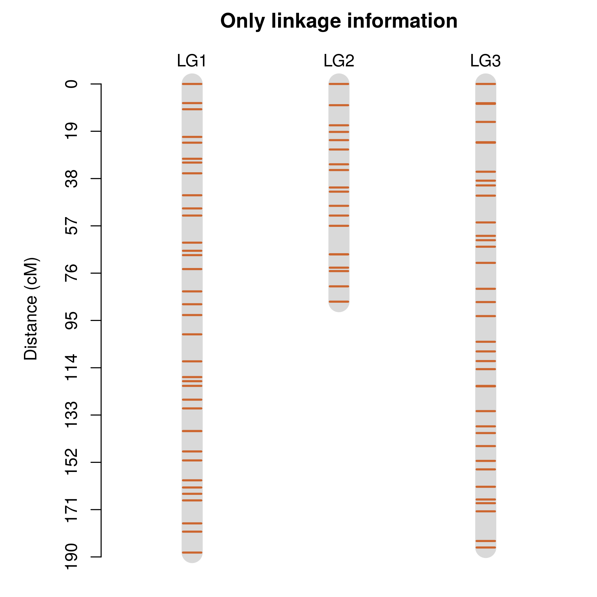
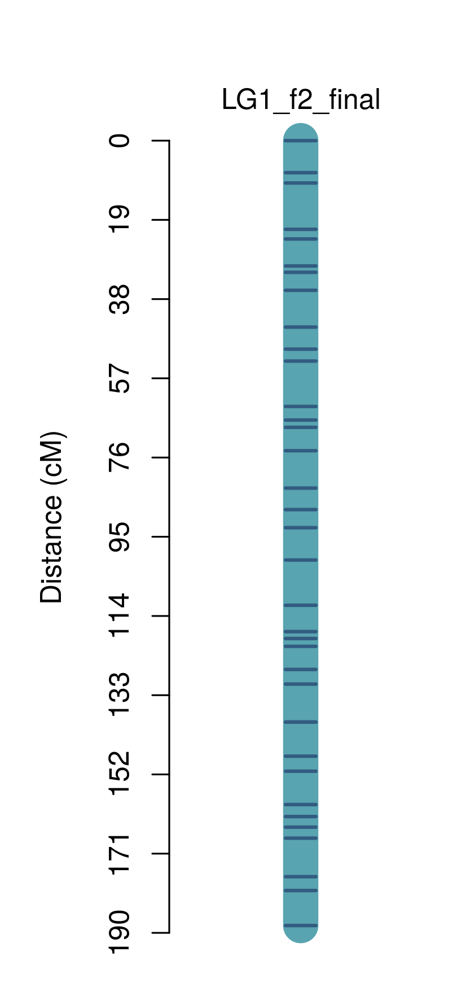
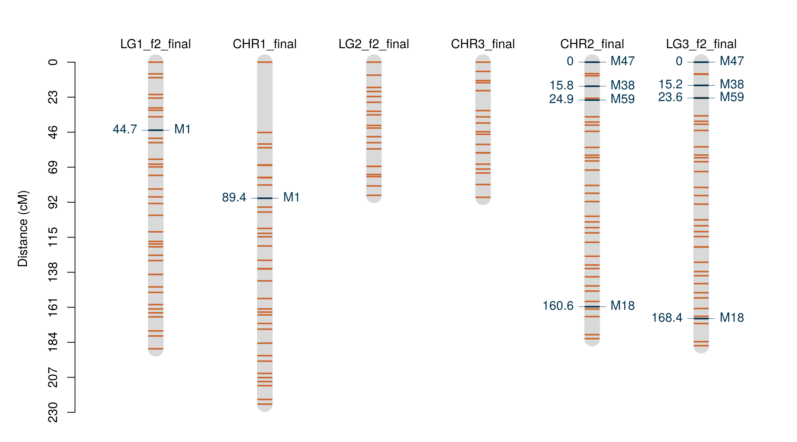

```{r knitr_init, echo=FALSE, cache=FALSE}
library(knitr)
library(rmdformats)

## Global options
options(max.print="75")

opts_knit$set(width=75)
```

Starting in version 2.0-0, `OneMap` can also deal with inbred-based
populations, that is, populations that have homozygous parental lines in
the genealogy (F2s, backcrosses and RILs). As a consequence, linkage
phases do not need to be estimated.

In this vignette we explain how to proceed the analysis in an F2
population. The same procedure can be used for backcrosses and RILs as
well, and therefore users should not have any difficulty in analyzing
their data. However, there are a number of differences from genetic
mapping in outcrossing species; please read the proper vignette.

If you are not familiar with `R`, we recommend first the reading of
vignette
[Introduction to R](https://htmlpreview.github.io/?https://github.com/augusto-garcia/onemap/blob/master/inst/doc/Introduction_R.html).
You do not need to be an expert in R to build your linkage map, but
some concepts are necessary and will help you through the process.

There is a github `OneMap` version which is constantly improved, we strong
recommend all users to try [this version](https://github.com/augusto-garcia/onemap). 
In `augusto-garcia/onemap` github page you can find instructions to install the package 
from github and also more fancy tutorials.

# Creating the data file

For F2s, backcrosses and RILs, two input formats are accepted. The user can choose between the standard {\sl OneMap} file format or the same raw file used by
`MAPMAKER/EXP` (Lander et al., 1987). Therefore, one should have no
difficulty in using data sets already available for `MAPMAKER/EXP` when
deciding to try `OneMap`.

Both types of raw file can contain phenotypic information, but this will not be used during
map construction, that requires only genotypic information (made
available by molecular markers).

## Creating `MAPMAKER/EXP` data file

The `MAPMAKER/EXP` raw file, combined with the map file produced by `OneMap`, can be
readily used for QTL mapping using `R/qtl` (Broman et al., 2008) or
`QTL Cartographer` (Wang et al., 2010), among others.

Here, we briefly present how to set up this data file. For more
detailed information see the `MAPMAKER/EXP` manual (Lincon et al.,
1993), available [here](https://home.cc.umanitoba.ca/~psgendb/birchhomedir/doc/mapmaker/mapmaker.tutorial.pdf).

The first line of your data file should be:

```
data type xxxx
```

where `xxxx` is one of the following data types:

| `xxxx`          | Population type             |
|-----------------|-----------------------------|
| `f2 backcross`  | Backcross                   |
| `f2 intercross` | F2                          |
| `ri self`       | RIL, produced by selfing    |
| `ri sib`        | RIL, produced by sib mating |

The second line should contain the number of individuals in the
progeny, the number of markers and the number of quantitative traits.
So, for example, a valid line would be

```
10 5 2
```

for a data set with 10 individuals (yes, very small, but this is just
an example), 5 markers and 2 traits evaluated.

Then, the genotype information is included for each marker. The
character `*` indicates the beginning of information of a marker,
followed by the marker name. For instance, here is an example of such
a file for an F2 population with 10 individuals, 5 markers and 2
quantitative traits:

```
data type f2 intercross
10 5 2

*M1 A B H H A - B A A B
*M2 C - C C C - - C C A
*M3 D B D D - - B D D B
*M4 C C C - A C C A A C
*M5 C C C C C C C C C C

*weight 10.2 - 9.4 11.3 11.9 8.9 - 11.2 7.8 8.1 
*length 1.7 2.1 - 1.8 2.0 1.0 - 1.7 1.0 1.1
```

The codification for genotypes is the following:

| Code  | Meaning                                        |
|-------|------------------------------------------------|
|  `A`  | homozygous for allele A (from parent 1 - AA)   |
|  `B`  | homozygous for allele B (from parent 2 - BB)   |
|  `H`  | heterozygous carrying both alleles (AB)        |
|  `C`  | Not homozygous for allele A (Not AA)           |
|  `D`  | Not homozygous for allele B (Not BB)           |
|  `-`  | Missing data for the individual at this marker |

The `symbols` option (not included in this example), used in
`MAPMAKER/EXP` files, is also accepted (please, see its manual for
details).

The quantitative trait data should come after the genotypic data and
has a similar format, except the trait values for each individual must
be separated by at least one space, a tab or a line break. A dash (`-`)
indicates missing data.

This file must be saved in plain text format using a simple text
editor such as _notepad_ on _Microsoft Windows_. Historically,
`MAPMAKER/EXP` uses the `.raw` extension for this file; however, you
can use any other extensions, such as `.txt`.

If you want to see more examples about this file type, open
`mapmaker_example_bc.raw` and `mapmaker_example_f2.raw`, both available with
`OneMap` and saved in the directory `extdata` on your computer, in the
folder where you installed `OneMap` (use
`system.file(package="onemap")` to see where it is located on your
computer).

Now, let us load `OneMap`:

```{r}
library(onemap)
``` 

To save your project anytime, type:

```{r, eval=FALSE}
save.image("C:/.../yourfile.RData")
```

if you are using Windows; otherwise, adapt the code. Notice that you
need to specify where to save and the name of the file. You can also
use the toolbar, of course.

## Creating `OneMap` data file

The `OneMap` data file has few differences compared to MAPMAKER/EXP format. As MAPMAKER/EXP format, the input `OneMap` file is a text file, where the first line indicates the cross type and the second line provides information about the number of individuals and the number of markers, but, because the format aldo supports to keep physical markers locations informations, the followed numbers indicate the presence/absence (1/0) of chromossome and position informations and, after the presence/absence(1/0) of phenotypic data. 

The third line contains sample IDs. Then, the genotype information is included separately for each marker. The
character `*` indicates the beginning of information input for a new
marker, followed by the marker name. Next, there is a code indicating the marker type according with:

| Code      | Type                          |
|-----------|-------------------------------|
|  `A.H.B`  | Codominant marker             |
|  `C.A`    | Dominant marker for allele B  |
|  `D.B`    | Dominant marker for allele A  |
|  `A.H`    | Marker for backcross          | 
|  `A.B`    | Marker for ril self/sib cross | 


Finally, after each marker type, comes the genotype data for the
segregating population. Missing
data are indicated with the character `-` (minus sign) and an empty space separates the information for each individual. Positions and phenotype information, if present, follows genotypic data with a similar structure. Details are found in the help of function `read_onemap`.

Here is an example of such file for 10 individuals and 5 markers (the three zeros in the second line indicate that there is no chromosome information, physical position information or phenotypic data, respectively). It
is very similar to a MAPMAKER/EXP file, but has additional information
about the crosstype.

```
data type f2 intercross
10 5 1 0 1
I1 I2 I3 I4 I5 I6 I7 I8 I9 I10
*M1 A.H.B  ab a - ab b a ab - ab b
*M2 A.H.B  a - ab ab - b a - a ab
*M3 C.A    c a a c c - a c a c
*M4 A.H.B  ab b - ab a b ab b - a
*M5 D.B    b b d - b d b b b d
*CHROM 1 1 1 2 2 2 3 3 3 3
*fen1 10.3 11.2 11.1 - 9.8 8.9 11.0 10.7 - 10.1
*fen2 42 49 - 45 51 42 28 32 38 40
```

The input file must be saved in text format, with extensions like
`.raw`. It is a good idea to open the text file called
`onemap_example_f2.raw` (available in `extdata` with `OneMap` and saved in the directory
you installed it) to see how this file should be. You can see where
`OneMap` is installed using the command

# Importing data


## From `MAPMAKER/EXP` file

Once you created your data file with raw data, you can use `OneMap`
function `read_mapmaker` to import it to `OneMap`:

```{r, eval=FALSE}
mapmaker_example_f2 <- read_mapmaker(dir="C:/workingdirectory", 
                                file="your_data_file.raw")
``` 

The first argument is the directory where the input file is located,
so modify it accordingly. The second one is the data file name.

In this example, an object named `mapmaker_example_f2.raw` was created. Notice
that if you leave the argument `dir` blank, the file will be read from
your current _working directory_. To set a working directory, see
[Introduction to R (Importing and Exporting Data)](https://htmlpreview.github.com/?https://github.com/augusto-garcia/onemap/blob/master/vignettes_html/Introduction_R.html).

```{r, eval=FALSE}
mapmaker_example_f2 <- read_mapmaker(file= system.file("extdata/mapmaker_example_f2.raw", 
                                                       package = "onemap"))
``` 

For this example, we will use a simulated data set from an F2
population which is distributed along with `OneMap`. Because this
particular data set is distributed along with the package, you can
load it typing

```{r, load_data}
data("mapmaker_example_f2")
``` 

To see what this data set is about, type

```{r}
mapmaker_example_f2
``` 

As you can see, the data consists of a sample of 200 individuals
genotyped for 66 markers (36 co-dominant (`AA`, `AB` or `BB`), 15
dominant in one parent (`Not AA` or `AA`) and 15 dominant in the other
parent (`Not BB` or `BB`) with 15% of missing data. You can also see
that there is phenotypic information for one trait in the data set, that can be
used for QTL mapping.

## From `OneMap` raw file

The same procedure is made for `OneMap` raw file, but, instead of using the function `read_mapmaker` we use `read_onemap` to read the `OneMap` format.

```{r, eval=FALSE}
onemap_example_f2 <- read_onemap(dir="C:/workingdirectory", 
                                inputfile = "your_data_file.raw")
``` 

In this example, an object named `onemap_example_f2.raw` was created. The data set containg the same markers and individual of the `mapmaker_example_f2.raw` file. Would be a good idea to open this two files in a text editor and compare them to better understand the differences between the two kinds of input files. We can read the `onemap_example_f2.raw` using:

```{r, eval=FALSE}
onemap_example_f2 <- read_onemap(inputfile= system.file("extdata/onemap_example_f2.raw", 
                                                       package = "onemap"))
``` 

Or, because this particular data are available together with `OneMap` package:

```{r}
data("onemap_example_f2")
```

To see what this data set is about, type

```{r}
onemap_example_f2
```

As you can see, the mean difference in the output object is that `read_onemap` function keeps chromossome and position informations. Because the objetcs `mapmaker_example_f2` and `onemap_example_f2` are pratically the same, from now we will use only `onemap_example_f2`.

## Importing data from `VCF` file

If you are working with biallelic markers, as SNPs and indels (only codominant markers A.H.B), in VCF (Variant Call Format) files, you can import information from `VCF` to `OneMap` using `onemap_read_vcfR` function.

With the `onemap_read_vcfR` you can convert the object from `vcfR` package directly to `onemap`. The `onemap_read_vcfR` function keeps chromosome and position information for each marker at the end of raw file.

We will use the same example file `vcf_example_f2.vcf` to show how it works.

First, we convert the `VCF` file to `vcfR` object:

```{r, eval=FALSE}
library(vcfR)
vcfR.object <- read.vcfR(system.file("extdata/vcf_example_f2.vcf", package = "onemap"))
```

As described in the `vcfR` package vignette, memory use is a important consideration when using `vcfR`. Depending of your dataset, the object created can be very large and occupy a lot of memory.

After, you can use `onemap_read_vcfR` function to convert this object to `onemap` object. The parameters used is the `vcfR.object` we just created, the identification of each parent (here you must define only one sample for each parent) and the cross type.

```{r, eval=FALSE}
vcf_example_f2 <- onemap_read_vcfR(vcfR.object = vcfR.object,
                                   parent1 = "P1", 
                                   parent2 = "P2", 
                                   cross = "f2 intercross")
```

Depending of your dataset, this function can take some time to run. 

After the convertion, we can save the `vcfR.object` as a `.RData` and to remove it from the workspace, once it can occupy a lot of memory and turn the other process too slow. 

```{r, eval=FALSE}
save(vcfR.object, file = "vcfR.object.RData") 
rm(vcfR.object)
```

From version 2.0.6 to 2.1.1005, OneMap had the `vcf2raw` function to convert `vcf` to `.raw`. Now, this function is defunct, but it can be replaced by a combination of `onemap_read_vcfR` and `write_onemap_raw` functions.

# Visualization of raw data

Before building your linkage map, you should take a look at your
data set. First, notice that by reading the raw data into `OneMap`, an
object of classes `onemap` and `f2` was produced:

```{r, echo=FALSE}
data(vcf_example_f2)
```


```{r, class_of_object,}
class(onemap_example_f2)
class(vcf_example_f2)
```

In fact, functions `read_mapmaker` and `read_onemap` will produce objects of classes
`backcross`, `riself`, `risib` or `f2`, according to
the information in the data file for inbred-based populations.
Therefore, you can use `OneMap`'s version of function `plot`
to produce a graphic with information about the raw data. It will
automatically recognize the class of the object and produce the
graphic. To see it in action, try:

```{r, plot_raw_data}
plot(onemap_example_f2)
plot(vcf_example_f2)
```

The graphic is self-explanatory. If you want to save it, see the help
for function `plot.onemap`:

```{r, eval=FALSE}
?plot.onemap
```

This graphic shows that missing data is somehow randomly distributed;
also, the proportion of dominant markers is relatively high for this
data set. In Onemap's notation, co-dominant markers are classified as
of B type; dominant ones, by C type (for details about this notation,
see the vignette for outcrossing species). You can see the number of
loci within each type using funcion `plot_by_segreg_type`:

```{r, plot_by_type}
plot_by_segreg_type(onemap_example_f2)
plot_by_segreg_type(vcf_example_f2)
```

So, as shown before, the object `onemap_example_f2` has 36 codominant markers and 30 dominant
ones and the `vcf_example_f2`has only codominant markers.

# Combining `OneMap` objects

If you have more than one dataset of markers, all from the same cross type, you can use the function `combine_onemap` to merge them into only one `onemap` object.

In our example, we have two `onemap` objects: 

* first: `onemap_example_f2` (equivalent to `mapmaker_example_f2`) with 66 markers and 200 individuals
* second: `vcf_example_f2` with 25 biallelic markers and 192 individuals.

The `combine_function` recognizes the correspondent individuals by the ID, thus, it is important define exactly same IDs to respective individuals in both `raw` files. Compared with the first file, the second file do not have markers informations for 8 individuals. The `combine_onemap` will complete those informations with NA.

In our examples, we have only genotypic information, but the function can also merge the phenotipic information if it exists.

```{r}
comb_example <- combine_onemap(onemap_example_f2, vcf_example_f2)
comb_example
```

The function arguments are the names of the `onemap` objects you want to combine.

Plotting markers genotypes from the outputted `onemap` object, we can see that there are more missing data `-` (black vertical lines) for some individuals, because they were missing in the second file.

```{r}
plot(comb_example)
```


# Exporting .raw file from onemap object

The functions `onemap_read_vcfR` generates new onemap objects without use a input `.raw` file. Also, the function `combine_onemap` manipulates the information of the original `.raw` file and creates a new data set. In both cases, you do not have a input file `.raw` that contains the same informations of the analysed data. If you want to create a new input file with the data set you are working after using this functions, you can use the function `write_onemap_raw`.  

```{r, eval=FALSE}
write_onemap_raw(comb_example, file.name = "new_dataset.raw", cross="f2 intercross")
```

The file `new_dataset.raw` will be generated in your working directory. In our example, it contains markers from `onemap_example_f2` and `vcf_example_f2` data sets.


# Segregation tests

Now, it should be interesting to see if markers are segregating
following what is expected by Mendel's law. You first need to use
function `test_segregation` using as argument an object of class
`onemap`.

```{r, chi_square}
f2_test <- test_segregation(comb_example)
```

This will produce an object of class `onemap_segreg_test`:

```{r, class_of_chisquare_test}
class(f2_test)
```

You cannot see the results if you simply type the object name; use Onemap's
version of the `print` function for objects of class `onemap_segreg_test`:

```{r, print_chi1}
f2_test
```

(Nothing is shown!)

```{r, print_chi2}
print(f2_test)
```

This shows the results of the Chi-square test for the expected
Mendelian segregation pattern of each marker locus. This depends of
course on marker type, because co-dominant markers can show heterozygous
genotypes. The appropriate null hypothesis is selected by the
function. The proportion of individuals genotyped is also shown.

To declare statistical significance, remember that you should consider
that multiple tests are being performed. To guide you in the analysis,
function `Bonferroni_alpha` shows the alpha value that should be considered
for this number of loci if applying Bonferroni's correction with
global alpha of 0.05:

```{r, Bonferroni}
Bonferroni_alpha(f2_test)
```

You can subset object `f2_test` to see which markers are distorted
under Bonferroni's criterion, but it is easier to see the proportion of
markers that are distorted by drawing a graphic using OneMap's version
of the function `plot` for objects of class `onemap_segreg_test`:

```{r, plot_chisq}
plot(f2_test)
```

The graphic is self-explanatory: _p_-values were transformed by using
`-log10(p-values)` for better visualization. A vertical line shows the
threshold for tests if Bonferroni's correction is applied. Significant
and non-significant tests are identified. In this particular example,
no test was statistically significant, so none will be discarded.

Please, remember that Bonferroni's correction is **conservative**, and
also that discarding marker data might not be a good approach to your
analysis. This graphic is just to suggest a criterion, so use it with
caution.

You can see a list of markers with non-distorted segregation using
function `select_segreg`:

```{r, select_nondistorted}
select_segreg(f2_test)
```

To get a list of distorted ones (none in this example):

```{r, select_distorted}
select_segreg(f2_test, distorted = TRUE)
```

It is not recommended, but you can define a different threshold value changing the `threshold` argument of the function `select_segreg`. 

For the next steps will be useful to know the numbers of each markers with segregation distortion, so then you can keep those out of your map building analysis. These numbers refer to the lines where markers are located on the data file.

To access the corresponding number for of this markers you can change the `numbers` argument:

```{r}
no_dist <- select_segreg(f2_test, distorted = FALSE, numbers = TRUE) #to show the markers numbers without segregation distortion
no_dist

dist <- select_segreg(f2_test, distorted = TRUE, numbers = TRUE) #to show the markers numbers with segregation distortion
dist

```

# Estimating two-point recombination fractions

After visualizing raw data and checking for segregation distortion, let
us now estimate recombination fractions between all pairs of markers
(two-point tests). This is necessary to allow us to test which
markers are linked. At this point, you should pay no attention if
markers show segregation distortion or not, that is, simply use all of
them.

```{r, two_point_tests, results="hide"}
twopts_f2 <- rf_2pts(comb_example)
``` 

There are two optional arguments in function `rf_2pts`: `LOD` and
`max.rf` which indicate the minimum LOD Score and the maximum
recombination fraction to declare linkage (they default to 3.0 and 0.5, respectively).

The default for the recombination fraction is easy to understand,
because if `max.rf < 0.5` we could state that markers are linked. The LOD
Score is the statistic used to evaluate the significance of the test
for `max.rf = 0.50`. This needs to take into consideration the number of
tests performed, which of course depends on the number of markers.
Function `suggest_lod` can help users to find an initial value to use
for their linkage test. For this example:

```{r, Suggest_a_LOD}
(LOD_sug <- suggest_lod(comb_example))
```

Thus, one should consider using `LOD = 4.155` for the tests. Please, notice
that this is just a guide, not a value to take without any further
consideration. For now, we will keep the default values, but later
will show that results do not change in our example by using `LOD = 3`
or `LOD = 4.155`.

If you want to see the results for a single pair of markers, say `M12` and
`M42`, use:

```{r, print_2Mks_two_points}
print(twopts_f2, c("M12", "M42"))
``` 

This was possible because `OneMap` has a version of the `print` function
that can be applied to objects of class `rf_2pts`:

```{r, class_of_twopoint}
class(twopts_f2)
```

However, objects of this type are too complex to print if you do not
specify a pair of markers:

```{r, print_all_two_points}
print(twopts_f2)
```

# Strategies for this tutorial example

In this example we follow two different strategies:

* Using only recombinations informations.

* Using the recombinations and also the reference genome informations, once our example have `CHROM` and `POS` informations for some of the markers.

First, we will apply the strategy using only recombinations informations. In a second part of this tutorial we show a way to use also reference genome informations. At the and of our analysis we will be able to compare this two strategies drawing the resulted genetic maps.

## Using only recombinations informations

### Assigning markers to linkage groups

To assign markers to linkage groups, first use the function `make_seq`
to create a (un-ordered) sequence with all markers:

```{r, subset_all}
mark_all_f2 <- make_seq(twopts_f2, "all")
```

Function `make_seq` is used to create sequences from objects of
several different classes. Here, the first argument is of class
`rf_2pts` and the second argument specifies which markers one wants to
use (`"all"` indicates that all markers will be analyzed). The object
`mark_all_f2` is of class `sequence`:

```{r, class_subset_all}
class(mark_all_f2)
```

If you want to form groups with a subset of markers, say `M1`, `M3`
and `M7`, use:

```{r, subset_3mks}
mrk_subset <- make_seq(twopts_f2, c(1, 3, 7))
``` 

In this case, it was easy because marker names and order in the
objects (indicated in vector `c(1, 3, 7)`) are closed related, that is,
you can easily know the position of markers in the object once you
know their names. However, this is not true for real data sets, where
markers do not have simple names such as `M1` or `M2`.

A good example is to use the vector of markers without segregation
distortion that we selected when applying the Chi-square tests. 

```{r, without segregation distortion}
mark_no_dist_f2 <- make_seq(twopts_f2, no_dist)
``` 

In our example, there are no markers with segretion distortion, then the object `mark_no_dist_f2` is equivalent to `mark_all_f2`.

### Forming the groups

You can assign markers to linkage groups using the function
`group`:

```{r, group1}
LGs_f2 <- group(mark_all_f2)
LGs_f2
``` 

This will show the linkage groups that are formed if criteria
defined by `max.rf` and `LOD` are applied to define thresholds to be
used when assigning markers to linkage groups. If not modified, the
same values used for the object `twopts` (from two-point analysis)
will be maintained (so, `LOD = 3.0` and `max.rf = 0.5` in this example).

Users can easily change the default values. For example, using LOD
suggested by `suggest_lod` (rounded up):

```{r, group2}
(LGs_f2 <- group(mark_all_f2, LOD = LOD_sug, max.rf = 0.5))
``` 

No difference was obtained in this example. (The parentheses above are
just to avoid typing `LGs_f2` in a new row to have the object printed).

We can see that the markers were assigned to three linkage groups with
27, 16 and 23 markers, with no unlinked markers.

Notice the class of object `LGs_f2`:

```{r, class_group}
class(LGs_f2)
```

### Ordering markers within linkage groups

After assignin markers to linkage groups, the next step is to
order the markers within each group.

First, let us choose the mapping function used to display the genetic
map. We can choose between Kosambi or Haldane mapping functions. To
use Haldane, type

```{r, haldane, eval=FALSE}
set_map_fun(type = "haldane")
```

To use Kosambi's function:

```{r, kosambi, eval=FALSE}
set_map_fun(type = "kosambi")
```

#### Linkage group 2

We will start our analysis using the smallest linkage group (group 2).
To do so, you must `extract` it from the object of class `group`. Let
us extract the group 2 using function `make_seq`:

```{r}
LG2_f2 <- make_seq(LGs_f2, 2)
``` 

The first argument is an object of class `group` and the second is a
number indicating which linkage group will be extracted. In this case,
the object `LGs_f2`, generated by function `group`, is of class
`group`. In fact, this function can handle different classes of
objects.

If you type
```{r}
LG2_f2
``` 

you will see which markers are comprised in the sequence. But notice
that no parameters have been estimated so far (the function says
_Parameters not estimated_). This refers to the fact that so far we
only attributed markers to linkage groups, but we did not perform any
analysis for them as a **group** - only as pairs. (Does it seem
complicated? Do not worry, you will understand details in a moment).

Notice the class of object `LG2_f2`:

```{r, class_lg}
class(LG2_f2)
```

To order markers in this group, you can use a two-point based
algorithm such as Seriation (Buetow and Chakravarti, 1987), Rapid
Chain Delineation (Doerge, 1996), Recombination Counting and Ordering
(Van Os et al., 2005) and Unidirectional Growth (Tan and Fu, 2006):
  
```{r, results="hide"}
LG2_ser_f2 <- seriation(LG2_f2)
LG2_rcd_f2 <- rcd(LG2_f2)
LG2_rec_f2 <- record(LG2_f2)
LG2_ug_f2 <- ug(LG2_f2)
``` 

For this particular data set, the algorithms provided different
results (results not printed in this vignette). For an evaluation and
comparison of these methods, see Mollinari et al. (2009).

When possible (_i.e._, when groups have a small number of markers, in
general up to 10 or 11), one should select the best order by comparing
the multipoint likelihood of all possible orders between markers
(exhaustive search). This procedure is implemented in the function
`compare`. Although feasible for up to 10 or 11 markers, with 7 or
more markers it will take a couple of hours until you see the results
(depending of course on the computational resources available).

Linkage group 2 has 18 markers, so using function `compare` is
infeasible. Thus we will apply a heuristic that shows reliable
results. First, we will choose a moderate number of markers, say 6, to
create a framework using the function `compare`, and then we will
position the remaining markers into this framework using function
`try_seq`. The way we choose these initial markers in inbred-based populations
is somewhat different from what we did for outcrossing populations,
where there is a mixture of segregation patterns (see the vignette for
details).

In our scenario, we recommend two methods:

 1. Randomly choose a number of markers and calculate the multipoint
    likelihood of all possible orders (using the function `compare`).
    If the LOD Score of the second best order is greater than a given
    threshold, say, 3, then take the best order to proceed with the
    next step. If not, repeat the procedure.
 2. Use some two-point based algorithm to construct a map; then, take
    equally spaced markers from this map. Then, create a framework of
    ordered markers using the function `compare`. Next, try to map the
    remaining markers, one at a time, beginning with co-dominant ones
    (most informative ones), then add the dominant ones.

You can do this procedure manually, in a similar way as done for
outcrossing species (see the vignette for details). However, this
procedure is automated in function `order_seq`, which we will use
here:

```{r, order_seq}
LG2_f2_ord <- order_seq(input.seq = LG2_f2, n.init = 5,
                        subset.search = "twopt",
                        twopt.alg = "rcd", THRES = 3)
                        
```

The first argument is an object of class `sequence` (LG2_f2). `n.init
= 5` means that five markers will be used in the `compare` step. The
argument `subset.search = "twopt"` indicates that these five markers
should be chosen by using a two point method, which will be Rapid
Chain Delineation, as indicated by the argument `twopt.alg = "rcd"`.
`THRES = 3` indicates that the `try_seq` step will only add markers to
the sequence which can be mapped with LOD Score greater than 3.

Check the order obtained by this procedure:

```{r, show_order_seq}
LG2_f2_ord
``` 

Note that markers `11`, `32`, `37`, `66` and `91` could not be safely mapped to a single
position (`LOD Score > THRES` in absolute value). The output displays
the `safe` order and the most likely positions for markers not mapped,
where `***` indicates the most likely position, and `*` corresponds to
other plausible positions. (If you are familiar with MAPMAKER/EXP, you
will recognize the representation).

To get the `safe` order, use

```{r, safe, results="hide"}
LG2_f2_safe <- make_seq(LG2_f2_ord, "safe")
``` 
and to get the order with all markers (_i.e._, including the ones not
mapped to a single position), use:

```{r, force}
(LG2_f2_all <- make_seq(LG2_f2_ord, "force"))
```

which places markers `11`, `32`, `37`, `66` and `91` into their most likely positions.

Although some old publications presented maps with only `safe` orders,
we see no reason not to use option `force`, and recommend it for
users. 

The `order_seq` function can perform two rounds of the `try_seq` step,
first using `THRES` and then `THRES - 1` as the threshold. This
generally results in safe orders with more markers mapped, but takes
longer to run. To do this, type:

```{r, touchdown}
LG2_f2_ord <- order_seq(input.seq = LG2_f2, n.init = 5,
                        subset.search = "twopt",
                        twopt.alg = "rcd", THRES = 3,
                        touchdown = TRUE)
``` 

The output is too big to be included here, so please try it to see
what happens. In short, for this particular sequence, the `touchdown`
step could additionally map two of the five markers (`37` and `66`), but this depends on the dataset. Let us continue our analysis
using the order with all markers as suggested by the function
`order_seq`:

```{r, lg2_final}
(LG2_f2_final <- make_seq(LG2_f2_ord, "force"))
``` 

Finally, to check for alternative orders, use the `ripple_seq` function:

```{r, ripple_lg2_final, results="hide"}
ripple_seq(LG2_f2_final, ws = 5, LOD = 3)
``` 

The second argument, `ws = 5`, means that subsets (windows) of five
markers will be permutated sequentially (5! orders for each
window), to search for other plausible orders. The `LOD` argument
means that only orders with LOD Score smaller than 3 will be printed.

The output shows sequences of five numbers, because `ws = 5`. They can
be followed by an `OK`, if there are no alternative orders with LOD
Scores smaller than `LOD = 3` in absolute value, or by a list of
alternative orders.

In this example, the first seven windows showed alternative orders with
LOD smaller than `LOD = 3`. However, the best order was that obtained
with the `order_seq` function (LOD = 0.00). If there were an alternative
order more likely than the original, one should check
the difference between them and, if necessary, change the order with
(for example) functions `drop_marker` (see Section about using an
arbitrary order) and `try_seq`, or simply by typing the new order. For that, use
`LG2_f2_final$seq.num` to obtain the original order; then make the
necessary changes (by copying and pasting) and use the function `map` to
reestimate the genetic map for the new order.

The final estimated map can then be printed using
    
```{r}
LG2_f2_final
```

This is based on multipoint estimation of recombination
fractions, using hidden Markov models.


#### Linkage group 1

Let us analyze linkage group 1. Extract markers from object `LGs`:

```{r}
LG1_f2 <- make_seq(LGs_f2, 1)
``` 

Construct the linkage map, by automatic usage of the `try` algorithm:

```{r, results='hide'}
LG1_f2_ord <- order_seq(input.seq = LG1_f2, n.init = 5,
                        subset.search = "twopt",
                        twopt.alg = "rcd", THRES = 3,
                        touchdown = TRUE)
``` 

The second round of `try_seq` added markers `9`, `12`, `29`, `35`, `58`, `71` and `72` (try
it; results not shown).

Get the order with all markers:

```{r}
(LG1_f2_final <- make_seq(LG1_f2_ord, "force"))
``` 

Check the final map (results not shown):

```{r, results="hide"}
ripple_seq(LG1_f2_final, ws = 5)
``` 

No alternative order was found (please, try it).

Print it:
```{r}
LG1_f2_final
```

This is the final version of the map for this linkage group.


#### Linkage group 3

Extract markers from object `LGs_f2`:

```{r}
LG3_f2 <- make_seq(LGs_f2, 3)
``` 

Construct the linkage map, by automatic usage of try algorithm.

```{r, order_LG3, results='hide'}
LG3_f2_ord <- order_seq(input.seq = LG3_f2, n.init = 5,
                        subset.search = "twopt",
                        twopt.alg = "rcd", THRES = 3,
                        touchdown = TRUE)
``` 

We can see that in the second round of `try_seq` markers `50`, `64`, `78` and `86` were
added (please, try it). A careful examination of the graphics can be a
good source of information about how markers where placed.

Now, get the order with all markers:

```{r, LG3_force}
(LG3_f2_final <- make_seq(LG3_f2_ord, "force"))
``` 

Check the final map (not shown):

```{r, ripple_LG3, results="hide"}
ripple_seq(LG3_f2_final, ws = 5)
``` 

No better alternative order was observed.

Print it:

```{r, LG3_final}
LG3_f2_final
```

# Plotting the recombination fraction matrix

It is possible to plot the recombination fraction matrix and LOD
Scores based on a color scale using the function `rf_graph_table`.
This matrix can be useful to make some diagnostics about the map.
  
Just as an example, let us place `M38` at the end of linkage group 3
(wrong position) to check how we can see that in the graphic. First, let
us to remove it from the linkage group:

```{r, remove_M38, results="hide"}
temp_seq <- drop_marker(LG3_f2_final, 38)
``` 

Now, we will force it to be positioned at the end of the linkage
group:

```{r, add_M38_end_LG}
(temp_seq <- add_marker(temp_seq, 38))
(LG3_f2_wrong <- map(temp_seq))
``` 


Examining the results, we can see there is a big gap at the end of
linkage group 3 (between markers `M50` and `M38`, as expected.

Let us now plot the recombination fraction matrix:

```{r, rec_matrix}
rf_graph_table(LG3_f2_wrong)
```

With default arguments, the graphic cells represents the recombination fractions. 
If you change the argument to `graph.LOD = TRUE`, LOD score values are plotted. The 
color scale varies from red (small distances and big LODs) to dark blue.

You can also plot an interactive version of this graphic, changing
option `inter` to `TRUE` and defined a name to the html file generated:

```{r, rec_matrix_inter, eval=FALSE}
rf_graph_table(LG3_f2_wrong, inter = TRUE, html.file = "LG3_f2_wrong.html")
```

An interactive version of the graphic will pop up (not shown here) in your internet browser
end generated a html file in your work directory.
Hover the mouse cursor over the cell corresponding to two markers, you can see some
useful information about them. For example, over the cell
corresponding to markers `M47` and `M19` you can see their names,
types (co-dominant and dominant), recombination fraction (`rf =
0.074`) and LOD Score (`LOD = 23`). Over a cell on the
diagonal, some information about the corresponding marker is shown,
including percentage of missing data. We found this to be very useful
when evaluating the results of the ordering algorithms.

You can also change que number of colors from `rainbow` palette with argument `n.colors`,
add/remove graphic main and axis title (`main` and `lab.xy`), and shows marker numbers,
insted of names in the axis (`mrk.axis`).

```{r}
rf_graph_table(LG3_f2_wrong, n.colors = 7, main="LG3", lab.xy = c("markers", "markers"), mrk.axis = "numbers")
```

We clearly see a different pattern for marker `M38`. The blue cell,
corresponding to markers `M50` and `M38`, indicates a big
recombination fraction between these markers as seen before (by
clicking, `rf = 0.4049`). Moreover, we can see a group of red cells
corresponding to marker `M38` and other markers  as `M47`, `M19`, `M39` and
`M49`. This pattern indicates small recombination fractions between
marker `M38` and these other markers. Hence, `M38` is supposed to be close to
them on the map.

Because we have enough evidence that marker `M38` is misplaced, let us
drop this marker and try to map it using the function `try_seq`:
  
```{r, width=9, height=9}
temp_seq <- drop_marker(LG3_f2_wrong, 38)
temp_map <- map(temp_seq)
(temp_try <- try_seq(temp_map, 38))
```

We can see that the most likely position for marker `M38` is between
markers `M39` and `M49` (position 4). The patterns on the color matrix
are now better. Therefore, you should do

```{r}
(LG3_f2_final <- make_seq(temp_try, 4))
``` 

We can also check the heatmap matrix for the other groups ordered. This is a good map diagnostic and can be used during the map building procedure:

```{r}
rf_graph_table(LG1_f2_final)

rf_graph_table(LG2_f2_final)
```

## Using the recombinations and the reference genome informations

In our example, we have reference genome chromosome and position informations for some of the markers, here we will examplify one method of using this informations to help build the genetic map.

With the `CHROM` informations in the input file, you can identify markers belonging to some chromosome using the function `make_seq` with the `rf_2pts` object. For example, assign the string `"1"` for the second argument to get chromosome 1 makers. The output sequence will be automatically ordered by `POS` informations.

```{r}
CHR1 <- make_seq(twopts_f2, "1")
CHR1
CHR2 <- make_seq(twopts_f2, "2")
CHR3 <- make_seq(twopts_f2, "3")

```

### Adding markers with no reference genome informations

According to `CHROM` informations we have three defined linkage groups, now we can try to group the markers without chromossome informations to them using recombination informations. For this, we can use the function `group_seq`:

```{r}
CHR_mks <- group_seq(input.2pts = twopts_f2, seqs = "CHROM", unlink.mks = mark_all_f2,
                      repeated = FALSE)
```

The function works as the function `group`, but considering preexisting sequences. Setting `seqs` argument with the string `"CHROM"`, it will considered the preexisting sequences according to `CHROM` information. You can also indicate others preexisting sequences if it make sense for your study. For that, you should inform a list with objects of class `sequences`, as the example:

```{r, eval=FALSE}
CHR_mks <- group_seq(input.2pts = twopts_f2, seqs = list(CHR1=CHR1, CHR2=CHR2, CHR3=CHR3), 
                      unlink.mks = mark_all_f2, repeated = FALSE)
```

In this case, the command had the same effect of the previous, because we indicate chromossome sequences, but others sequences can be used.
 
The `unlink.mks` argument receive a object of class `sequence`, this define which markers will be tested to group with the sequences in `seqs`. In our example, we will indicate only the markers with no segregation distortion, using the sequence `mark_no_dist`. It is also possible to use the string `"all"` to test all the remining markers at the `rf_2pts` object. 

In some cases, the same marker can group to more than one sequence, those markers will be considered `repeated`. We can choose if we want to remove or not (`FALSE/TRUE`) them of the output sequences, with the argument `rm.repeated`. Anyway, their numbers will be informed at the list `repeateds` in the output object. 
In the example case, there are no repeated markers. However, if they exists, it could indicate that their groups actually constitute the same group. Also, genotyping erros can generate repeated markers. Anyway, they deserves better investigations. 

We can access detailed information about the results just printing:

```{r}
CHR_mks
```

Also, we can access the numbers of repeated markers with:

```{r}
CHR_mks$repeated
```

The same way, we can access the output sequences:

```{r}
CHR_mks$sequences$CHR1
# or
CHR_mks$sequences[[1]]
```

For this function, optional arguments are `LOD` and `max.rf`, which
define thresholds to be used when assigning markers to linkage groups.
If none provided (default), criteria previously defined for the object
`rf_2pts` are used.

Now we can order the markers in each group as we made before ([Ordering markers within linkage groups](#Ordering markers within linkage groups)). As showed, we can choose different approaches to order the markers. 

To order those groups, first we will use `order_seq` function to access a preliminary order and after, we will edit some markers position or remove some of them according with they color pattern in `rf_graph_table` graphic, and other parameters as likelihood and map size. 

#### Linkage group 1

```{r, results='hide'}
CHR1_ord <- order_seq(CHR_mks$sequences$CHR1)
CHR1_frame <- make_seq(CHR1_ord, "force")
```

```{r, eval=FALSE}
rf_graph_table(CHR1_frame) # graphic not showed
```

The group is similar to that builded before with only recombinations informations. We will better explore differences in a latter step. Only marker `58` do not follow exactly the expected color pattern, then we will try to repositioned it.

```{r}
CHR1_test_seq <- drop_marker(CHR1_frame, 58)
CHR1_test_map <- map(CHR1_test_seq)
CHR1_add58_seq <- try_seq(CHR1_test_map, 58)
CHR1_add58 <- make_seq(CHR1_add58_seq, 20) # marker 58 was placed at the same position as before
```

Comparing with and without marker 58:

```{r}
CHR1_test_map
```

```{r, eval=FALSE}
rf_graph_table(CHR1_test_map) # graphic not showed
```

```{r}
CHR1_add58
```

```{r, eval=FALSE}
rf_graph_table(CHR1_add58)
```

```{r, echo=FALSE}
rf_graph_table(CHR1_add58, inter = FALSE)
```

Based in those results, we decide to keep marker 58 in our map.

```{r}
CHR1_final <- CHR1_add58
```

Checking for better orders:

```{r}
ripple_seq(CHR1_final)
```

#### Linkage group 2

```{r, results='hide'}
CHR2_ord <- order_seq(CHR_mks$sequences$CHR2)
CHR2_frame <- make_seq(CHR2_ord, "force")
```

```{r, eval=FALSE}
rf_graph_table(CHR2_frame) # graphic not showed
```

The marker `20` presented a color pattern different of expected.

```{r}
CHR2_test_seq <- drop_marker(CHR2_frame, 20)
CHR2_test_map <- map(CHR2_test_seq)
CHR2_add20_seq <- try_seq(CHR2_test_map, 20)
CHR2_add20 <- make_seq(CHR2_add20_seq, 20) # marker 20 was placed at the same position as before
```

Comparing with and without marker 58:

```{r}
CHR2_test_map
```

```{r}
rf_graph_table(CHR1_test_map)
```

```{r}
CHR2_add20
```

```{r, eval=FALSE}
rf_graph_table(CHR2_add20)  # graphic not showed
```


Based in those results, we decide to not include marker 20 in our map.

```{r}
CHR2_final <- CHR2_test_map
```

Checking for better orders:

```{r}
ripple_seq(CHR2_final)
```


#### Linkage group 3 

```{r, results='hide'}
CHR3_ord <- order_seq(CHR_mks$sequences$CHR3)
CHR3_frame <- make_seq(CHR3_ord, "force")
```

```{r, eval=FALSE}
rf_graph_table(CHR3_frame) # graphic not showed
```


Here, marker `32` have color pattern too different of the expected, removing it could influentiate in other markers ordering. Then, we will remove it and search for a new order.

```{r, results='hide'}
CHR3_test_seq <- drop_marker(CHR3_frame, 32)
CHR3_test_ord <- order_seq(CHR3_test_seq)
CHR3_test_map <- make_seq(CHR3_test_ord, "force")
```

The order did not change.

Trying to add the marker again.

```{r, results='hide'}
CHR3_add32_seq <- try_seq(CHR3_test_map, 32)
CHR3_add32 <- make_seq(CHR3_add32_seq, 13) # Marker 32 keeped in the map
```

```{r}
CHR3_final <- CHR3_add32
rf_graph_table(CHR3_final, inter = FALSE)
```

Checking for better orders:

```{r}
ripple_seq(CHR3_final)
```


# Ordering large amount of markers

In our examples until now we had few markers compared with those obtained by high-throughput technologies. Ordering several markers using the `order_seq` function combined with `drop_marker` 
and `try_seq` can be a hardy and slow work. To help this task, we create the function `mds_onemap`
wich makes a interface between `OneMap` and `MDSMap` package. The ordering approach presented in
`MDSMap` provides a faster and efficient way of ordering markers using multi-dimensional scaling. 
The method also provides diagnostics graphics and parameters to find outliers to help users to filter the dataset. You can find more informations in `MDSMap` [vignette](https://cran.r-project.org/web/packages/MDSMap/vignettes/MDSMap.pdf). 

# Map estimation for an arbitrary order

If you have some information about the order of the markers, for
example, from a reference genome or previously published paper, you can
define a sequence of those markers in a specific order (using the function `make_seq`) and
then use the function `map` to estimate the final genetic map (based
on multipoint analysis). For example, let us assume that we know that
the following markers are ordered in this sequence: `M47`, `M38`, `M59`,
`M16`, `M62`, `M21`, `M20`, `M48` and `M22`. In this case, select them
from the two point analysis, and use function `map`:

```{r}
LG3seq_f2 <- make_seq(twopts_f2, c(47, 38, 59, 16, 62, 21, 20, 48, 22))
(LG3seq_f2_map <- map(LG3seq_f2))
```

To see the correspondence between marker names and numbers, use
function `marker_type`:

```{r, markers_names_and_numbers}
marker_type(LG3seq_f2_map)
``` 

If one needs to add or drop markers from a predefined sequence,
functions `add_marker` and `drop_marker` can be used. For example, to
add markers `M18`, `M56` and `M50` at the end of `LG3seq_f2_map`:

```{r, add_marker}
(LG3seq_f2_map <- add_marker(LG3seq_f2_map, c(18, 56, 50)))
```

Removing markers `M59` and `21` from `LG3seq_f2_map`:

```{r, drop_marker}
(LG3seq_f2_map <- drop_marker(LG3seq_f2_map, c(59, 21)))
```

# Drawing the genetic map

Once all linkage groups were obtained using both strategies, we can draw a map for each strategy using the function `draw_map`. Since version 2.1.1007, OneMap has a new version of `draw_map`, called `draw_map2`. The new function draws elegant linkage groups, and presents new arguments to personalize your draw.

If you prefer the old function, we also keep it. Follow examples how to use both of them.

## `Draw_map`

We can draw a genetic map for all linkage groups using the function
`draw_map`. First we have to create a list of ordered linkage groups:
  
```{r}
maps_list <- list(LG1_f2_final, LG2_f2_final, LG3_f2_final)
```

Then use function `draw_map` for this list:

```{r}
draw_map(maps_list, names = TRUE, grid = TRUE, cex.mrk = 0.7)
``` 

We also can draw a map for a specific linkage group:

```{r}
draw_map(LG1_f2_final, names = TRUE, grid = TRUE, cex.mrk = 0.7)
``` 

Let's use this function to overview the maps builded by different strategies in this tutorial:

```{r}
map_list_all <- list(LG1_f2_final, CHR1_final, LG2_f2_final, CHR3_final, CHR2_final, LG3_f2_final)
draw_map(map_list_all, names = TRUE, grid = TRUE, cex.mrk = 0.7)

```

Function `draw_map` draws a very simple graphic
representation of the genetic map. More recently, we developed a new version called `draw_map2` that draws a more sophisticated figure. Furthermore, once the distances and the
linkage phases are estimated, other map figures can be drawn by the
user with any appropriate software. There are several free software
that can be used, such as `MapChart` (Voorrips, 2002).

## `Draw_map2`

The same figures did with `draw_map` can be done with `draw_map2` function. But it has different capacities and arguments. Here are some examples, but you can find more options in the help page `?write_map2`.

First, for all three groups built only with linkage information:

```{r, eval=FALSE, results='hide', eval=FALSE}
draw_map2(LG1_f2_final, LG2_f2_final, LG3_f2_final, main = "Only linkage information", 
          group.names = c("LG1", "LG2", "LG3"))
```

```{r, echo=FALSE, results='hide', echo=FALSE}
draw_map2(LG1_f2_final, LG2_f2_final, LG3_f2_final, main = "Only linkage information", 
          group.names = c("LG1", "LG2", "LG3"), output = "map.png")
```



You can include all `sequence` objects refering to the groups as the first arguments. The `main` argument define the main title of the draw and `group.names` define the names of each group. If no `output` file and file extension is defined, the draw will be generated at you working directory as `map.eps`. The eps extension is only the default option but there are others that can be used. You can have access to a list of them at the help page.

We also can draw a map for a specific linkage group:

```{r, results='hide', eval=FALSE}
draw_map2(LG1_f2_final, col.group = "#58A4B0", col.mark = "#335C81", output = "map_LG1.pdf")
``` 

```{r, results='hide', echo=FALSE}
draw_map2(LG1_f2_final, col.group = "#58A4B0", col.mark = "#335C81", output = "map_LG1.png")
``` 



You can also change the default colors using the `col.group` and `col.mark` arguments.

Let's use this function to overview the maps builded by different strategies in this tutorial:

```{r, results='hide', eval=FALSE}
draw_map2(LG1_f2_final, CHR1_final, LG2_f2_final, CHR3_final, CHR2_final, LG3_f2_final, 
          tag = c("M18", "M59", "M38", "M47", "M1"),
          output = "map_all.pdf")

```

```{r, results='hide', echo=FALSE}
draw_map2(LG1_f2_final, CHR1_final, LG2_f2_final, CHR3_final, CHR2_final, LG3_f2_final,
          tag = c("M18", "M59", "M38", "M47", "M1"),
          output = "map_all.png")

```



With argument `tag` you can highlight some markers at the figure according to you specific purpose.

# Final remarks

At this point it should be clear that any potential `OneMap` user must
have some knowledge about genetic mapping and also the R language,
because the analysis is not done with **_only one mouse click_**. In the
future, perhaps a graphical interface will be made available to make
this software a lot easier to use.

We do hope that `OneMap` is useful to researchers interested
in genetic mapping in outcrossing or inbred-based populations. Any
suggestions and critics are welcome.

# Session Info

```{r}
sessionInfo()
```

# References

Adler, J. **_R in a Nutshell_** A Desktop Quick Reference, 2009.

Broman, K. W., Wu, H., Churchill, G., Sen, S., Yandell, B. **_qtl:
Tools for analyzing QTL experiments_** R package version
1.09-43, 2008.

Buetow, K. H., Chakravarti, A. Multipoint gene mapping using
seriation. I. General methods. **_American Journal of Human
Genetics_** 41, 180-188, 1987.

Doerge, R.W. Constructing genetic maps by rapid chain delineation.
**_Journal of Agricultural Genomics_** 2, 1996.

Garcia, A.A.F., Kido, E.A., Meza, A.N., Souza, H.M.B., Pinto, L.R.,
Pastina, M.M., Leite, C.S., Silva, J.A.G., Ulian, E.C., Figueira, A.
and Souza, A.P. Development of an integrated genetic map of a
sugarcane _Saccharum spp._ commercial cross, based on a
maximum-likelihood approach for estimation of linkage and linkage
phases. **_Theoretical and Applied Genetics_** 112, 298-314, 2006.

Haldane, J. B. S. The combination of linkage values and the
calculation of distance between the loci of linked factors. **_Journal
of Genetics_** 8, 299-309, 1919.

Jiang, C. and Zeng, Z.-B. Mapping quantitative trait loci with
dominant and missing markers in various crosses from two inbred lines.
**_Genetica_** 101, 47-58, 1997.

Kosambi, D. D. The estimation of map distance from recombination
values. **_Annuaire of Eugenetics_** 12, 172-175, 1944.

Lander, E. S. and Green, P. Construction of multilocus genetic linkage
maps in humans. **_Proc. Natl. Acad. Sci. USA_** 84, 2363-2367, 1987.

Lander, E.S., Green, P., Abrahanson, J., Barlow, A., Daly, M.J.,
Lincoln, S.E. and Newburg, L. MAPMAKER, An interactive computing
package for constructing primary genetic linkage maps of experimental
and natural populations. **_Genomics_** 1, 174-181, 1987.

Lincoln, S. E., Daly, M. J. and Lander, E. S. Constructing genetic
linkage maps with MAPMAKER/EXP Version 3.0: a tutorial and reference
manual. **_A Whitehead Institute for Biomedical Research Technical
Report_** 1993.

Matloff, N. **_The Art of R Programming_**. 2011. 1st ed. San
Francisco, CA: No Starch Press, Inc., 404 pages.

Margarido, G. R. A., Souza, A.P. and Garcia, A. A. F. OneMap: software
for genetic mapping in outcrossing species. **_Hereditas_** 144,
78-79, 2007.

Mollinari, M., Margarido, G. R. A., Vencovsky, R. and Garcia, A. A. F.
Evaluation of algorithms used to order markers on genetics maps.
**_Heredity_** 103, 494-502, 2009.

Oliveira, K.M., Pinto, L.R., Marconi, T.G., Margarido, G.R.A.,
Pastina, M.M., Teixeira, L.H.M., Figueira, A.M., Ulian, E.C., Garcia,
A.A.F., Souza, A.P. Functional genetic linkage map on EST-markers for
a sugarcane (_Saccharum spp._) commercial cross. **_Molecular
Breeding_** 20, 189-208, 2007.

Oliveira, E. J., Vieira, M. L. C., Garcia, A. A. F., Munhoz, C.
F.,Margarido, G. R.A., Consoli, L., Matta, F. P., Moraes, M. C.,
Zucchi, M. I., and Fungaro,M. H. P. An Integrated Molecular Map of
Yellow Passion Fruit Based on Simultaneous Maximum-likelihood
Estimation of Linkage and Linkage Phases **_J. Amer. Soc. Hort.
Sci._** 133, 35-41, 2008.

Tan, Y., Fu, Y. A novel method for estimating linkage maps.
**_Genetics_** 173, 2383-2390, 2006.

Van Os H, Stam P, Visser R.G.F., Van Eck H.J. RECORD: a novel method
for ordering loci on a genetic linkage map. **_Theor Appl Genet_**
112, 30-40, 2005.

Voorrips, R.E. MapChart: software for the graphical presentation of
linkage maps and QTLs. **_Journal of Heredity_** 93, 77-78, 2002.

Wang S., Basten, C. J. and Zeng Z.-B. Windows QTL Cartographer 2.5.
Department of Statistics, North Carolina State University, Raleigh,
NC, 2010.
[https://brcwebportal.cos.ncsu.edu/qtlcart/](https://brcwebportal.cos.ncsu.edu/qtlcart/)

Wu, R., Ma, C.X., Painter, I. and Zeng, Z.-B. Simultaneous maximum
likelihood estimation of linkage and linkage phases in outcrossing
species. **_Theoretical Population Biology_** 61, 349-363, 2002a.

Wu, R., Ma, C.-X., Wu, S. S. and Zeng, Z.-B. Linkage mapping of
sex-specific differences. **_Genetical Research_** 79, 85-96, 2002b.

